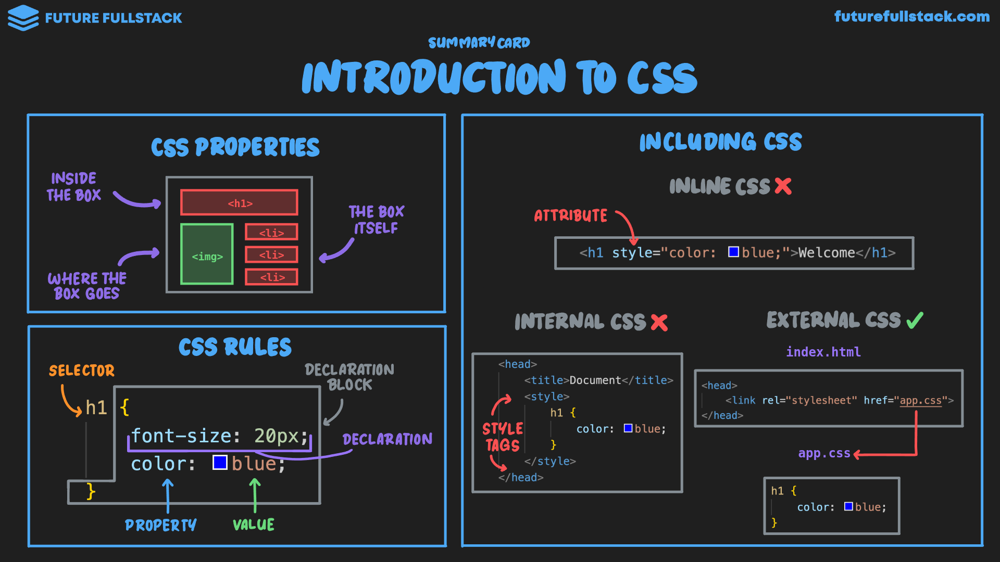

# Introducción

CSS trata a cada elemento HTML como si estuviera dentro de una [caja invisible](./04-box-model/01-box-model.md).

??? tip "Block & Inline Elements"

    Saber si un elemento HTML es de tipo [bloque o en línea](../html/06-containers.md#__tabbed_1_1) es crucial,
    ya que influye significativamente en el estilo y diseño CSS.

=== "CSS Properties"

    |:lucide-type: Contenido _Dentro de la caja_|:lucide-square-dashed: Box _La caja_|:lucide-layout-freeform: Disposición _Donde va la caja_|
    |:---:|:---:|:---:|
    |Tamaño de fuente|Ancho & Alto|Flexbox|
    |Grosor de fuente|Borde|Grid|
    |Color de fondo|Margen|Posición|
    |...|...|...|

=== "Including CSS"

    - **Inline CSS:** Dentro de un elemento HTML en específico.
    - **Internal CSS:** Declarando las reglas dentro de la cabecera del archivo HTML.
    - **External CSS:** Declarando las reglas en un archivo externo.
