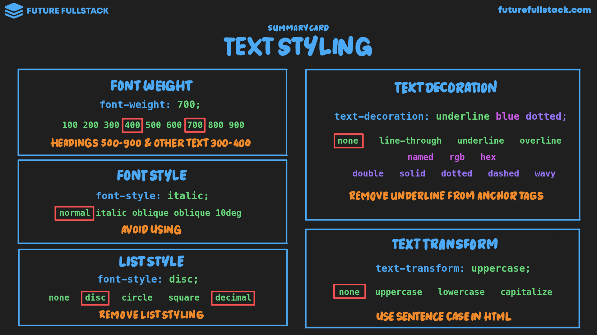

# Estilo de texto



=== "Font Weight"

    Establece el grosor de los caracteres de texto.

    !!! tip "Guía"

        - Los ^^encabezados^^ deben estar entre **500 a 900**.
        - ^^Otros textos^^ deben estar entre **300 a 400**.

    _Valores comunes_

    |Valor|Descripción|
    |---|---|
    |400|Normal|
    |500|Medium|
    |700|Bold|

=== "Font Style"

    Establece el estilo de la fuente.

    !!! tip "Guía"

        - Se prefiere utilizar _font weight_ y color.
        - Puede ser usado para llamar la atención.
          ```html
          <h1>Cut your publishing time <span style="font-style: italic;">in half</span></h1>
          ```

=== "List Style"

    Establece el estilo de la lista.

    !!! tip "Guía"

        **Siempre** se debe remover el estilo de las listas cuando sean
        usadas con [propósitos estructurales](../../html/02-text.md#__tabbed_2_2).

=== "Text Decoration"

    Establece las líneas decorativas del texto.

    !!! tip "Guía"

        - **Siempre** se debe remover el subrayado de los hipervínculos (`#!html <a href="...">`).
        - Se recomienda utilizar la decoración de texto con **poca frecuencia**.

    ```css
    ... {
                            /* (1)! */    /* (2)! */   /* (3)! */
        text-decoration: underline blue dotted
    }
    ```

    1. Tipo de línea
    2. Color de la línea
    3. Estilo de la línea

=== "Text Transform"

    Establece las mayúsculas y minúsculas del texto.

    !!! tip "Guía"

        Se recomienda mantener el uso de mayúsculas en cada oración.

        ```txt
        Sentence Case
        ```
