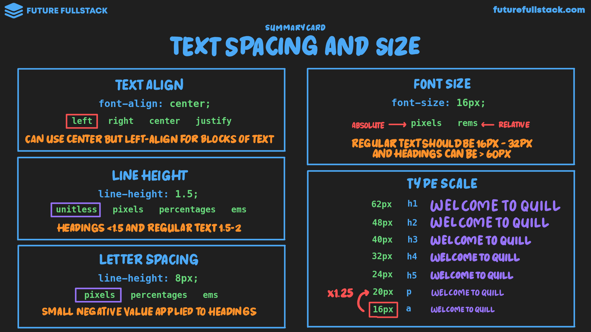
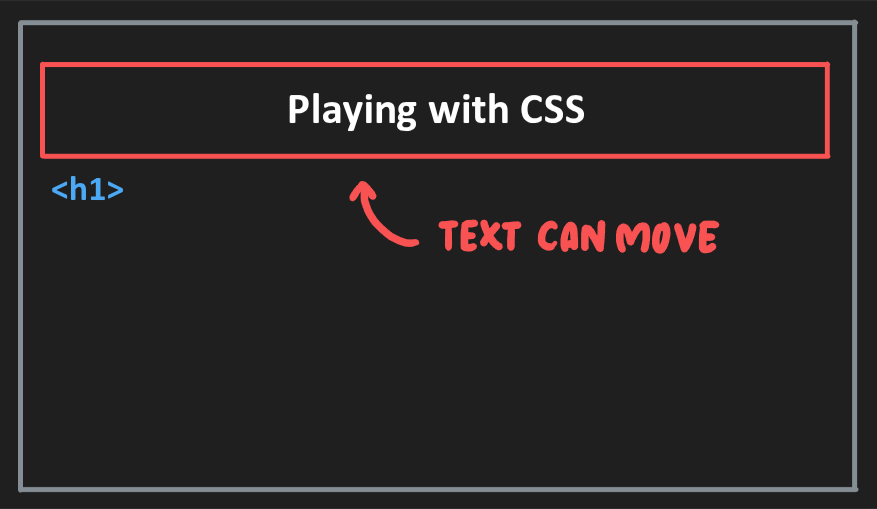
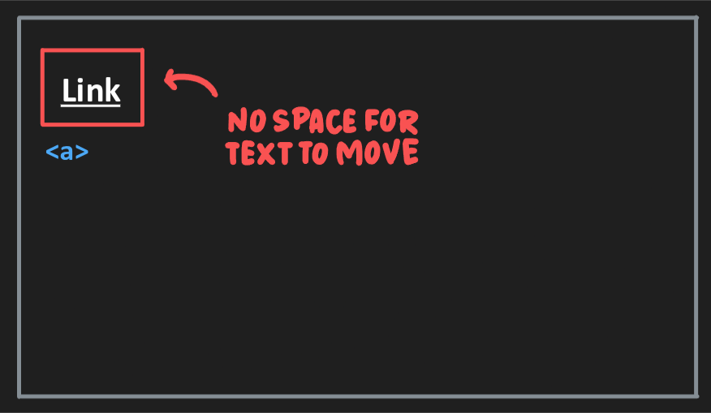

# Tamaño y espaciado de texto

=== "Text Align"

    Establece la alineación horizontal de un texto dentro de un elemento.

    ??? warning "Block vs Inline"

        |Bloque|En línea|
        |---|---|
        |**Si** hay espacio para que el ^^texto pueda moverse^^ |**No** hay espacio para que el ^^texto pueda moverse^^ |

    !!! tip "Guía"

        - **No** justifiques.
        - ^^Bloques largo de texto^^ deberían estar **alineados a la izquierda**.
        - ^^Encabezados^^ pueden estar **centradas**.

=== "Line Height"

    Establece el interlineado del texto.

    !!! tip "Guía"

        - ^^Encabezados^^ deberían ser **menores a 1.5**
        - ^^Texto regular^^ debería estar entre **1.5 a 2**

=== "Letter Spacing"

    Establece el espacio entre cada letra del texto.

    !!! tip "Guía"

        Se suele aplicar un **pequeño valor negativo** en pixeles _(i.e `-3.6px`)_
        a los ^^encabezados^^ para mejorar la legibilidad.

=== "Font Size"

    Establece el tamaño de la fuente.

    !!! tip "Guía"

        - ^^Encabezados^^ deberían ser **mayor a 60px**
        - ^^Texto regular^^ debería estar entre **16px a 32px**

    !!! tip "¿Cómo eligo el tamaño?"

        Usando una **escala tipográfica**: Sistema estructurado de tamaños de fuente que aporta coherencia visual y agiliza las decisiones de diseño.

        :lucide-link: [Referencia](https://typescale.com/)

    ??? info "Unidades"

        |Absolutas|Relativas|
        |---|---|
        |`px`|`%`|
        |`pt`|`em`|
        |`in`|`rem`|
        |`cm`|`vh`|
        |`mm`|`vw`|
