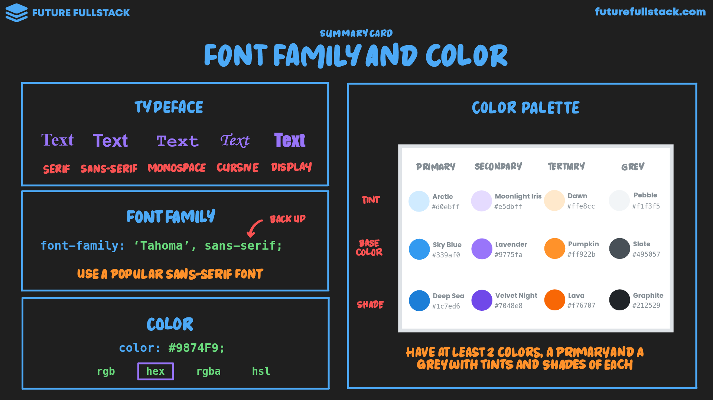
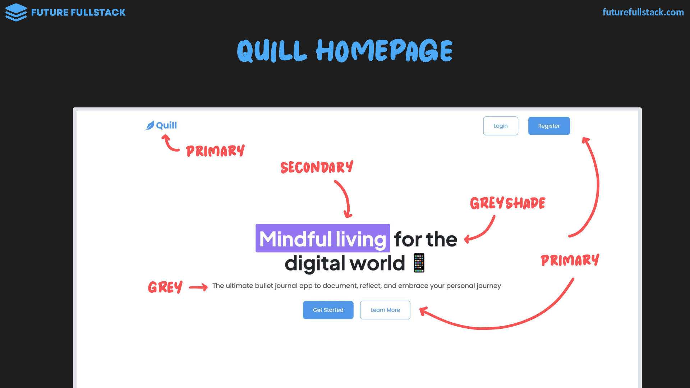
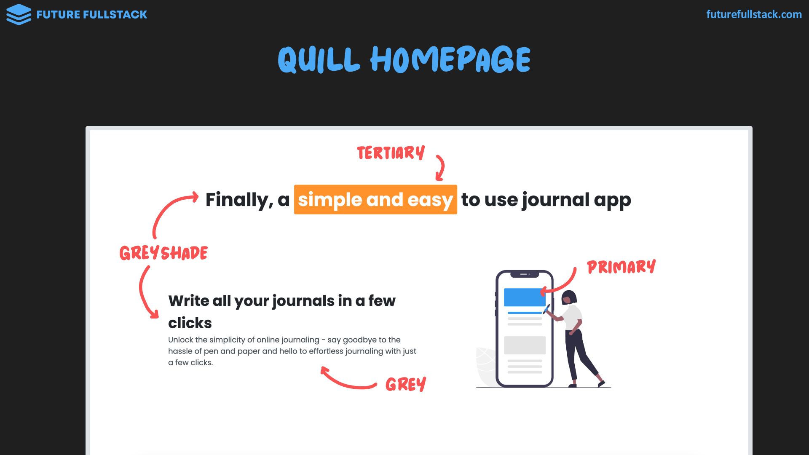

# Color y familia

=== "Typeface"

    ^^Tipografía^^: Caracteres con características visuales consistentes.

    |Serif|Sans-Serif|Monospace|Cursive|Display|
    |-----|----------|---------|-------|-------|
    |Detalles adicionales al final de los trazos|Trazos rectos al final y aspecto más limpio|Caracteres con el mismo ancho|Trazos continuos o imitación de escritura a mano|Llamativa y con carácter artístico|
    ||||||
    |^^Clásico^^: **Lujo y Confianza**|^^Limpio y moderno^^: **Simplicidad y Claridad**|^^Técnico^^: **Exactitud y Precisión**|^^Personal e Intimo^^: **Conexión emocional**|^^Creatividad^^: **Diversión y Transgresión**|

=== "Font Family"

    Establece una lista de tipografías o tipos de tipofrafías a priorizar.

    !!! tip "Guía"

        - Utiliza Google Fonts para no depender de las fuentes instaladas
          en el dispositivo de cada usuario
        - Para ir sobre seguro, elige una fuente sans-serif popular
        - Elige 1 o 2 fuentes para toda la aplicación, no más

=== "Color"

    !!! tip "Guía: Paleta de colores"

        - Ten **al menos ^^2 colores^^** en tu paleta: Un **color primario** y un **gris**.
        - Cada color debe tener **variantes ^^claras y oscuras^^**

        |:lucide-palette: Primario|:lucide-palette: Complementario|:lucide-palette: Gris|
        |---|---|---|
        |**Principal:** Resalta partes importantes **Claros y Oscuros:** Crea contraste|Añade variedad||
        |Usado en elementos dominantes: • Botones • Colores de fondo • Iconos|Mismos usos que el primario|Usado en fuentes|

    ??? example "Ejemplos"

        
        
