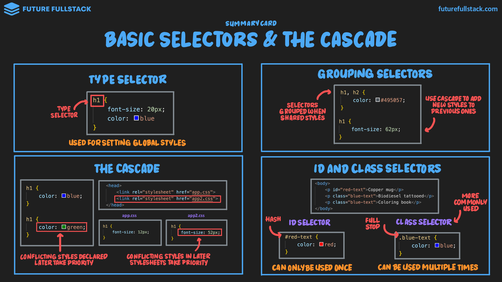

# Selectores básicos

=== "Type Selector"

    Selecciona elementos basados en el nombre de su [etiqueta](../../html/01-introduction.md#__tabbed_1_1).

    !!! tip "Uso"

        Estilos globales que aseguran consistencia.

=== "The Cascade"

    !!! tip "Funcionamiento"

        - **Estilos** declarados ^^posteriormente^^ tomarán prioridad.
        - **Archivos de estilos** declarados ^^posteriormente^^ tomarán prioridad.

=== "Grouping Selectors"

    !!! tip "Uso"

        Aplica **estilos compartidos** a diferentes elementos.

=== "ID & Class Selectors"

    !!! tip "Guía"

        - Se usará con mucha frecuencia el **selector de clases** debido a su ^^flexibilidad y reusabilidad^^.
        - Por medio del ^^selector de clases^^ se puede lograr un **diseño modular basado en componentes**.

        |:lucide-hash: ID|:lucide-dot-square: Class|
        |---|---|
        |Estiliza un solo elemento.|Estiliza varios elementos a la vez.|

    ??? example "Ejemplos"

        <!-- Poner pagina 141 y 142 -->
