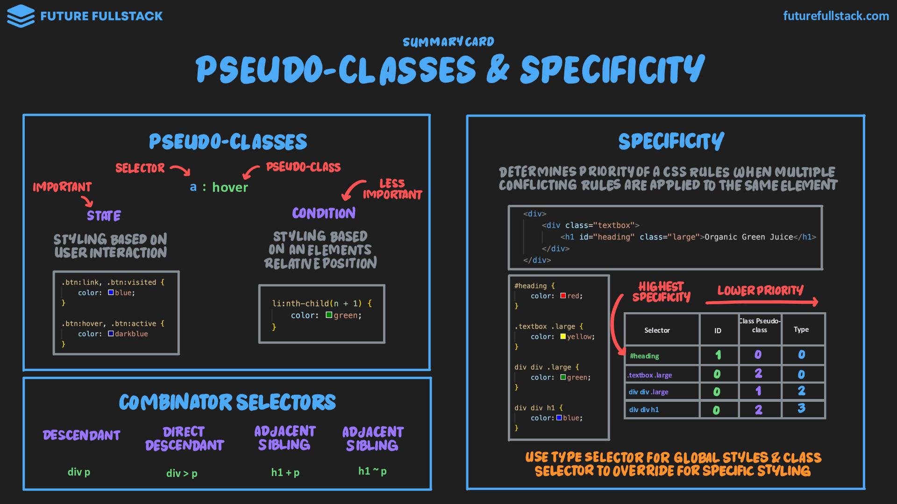
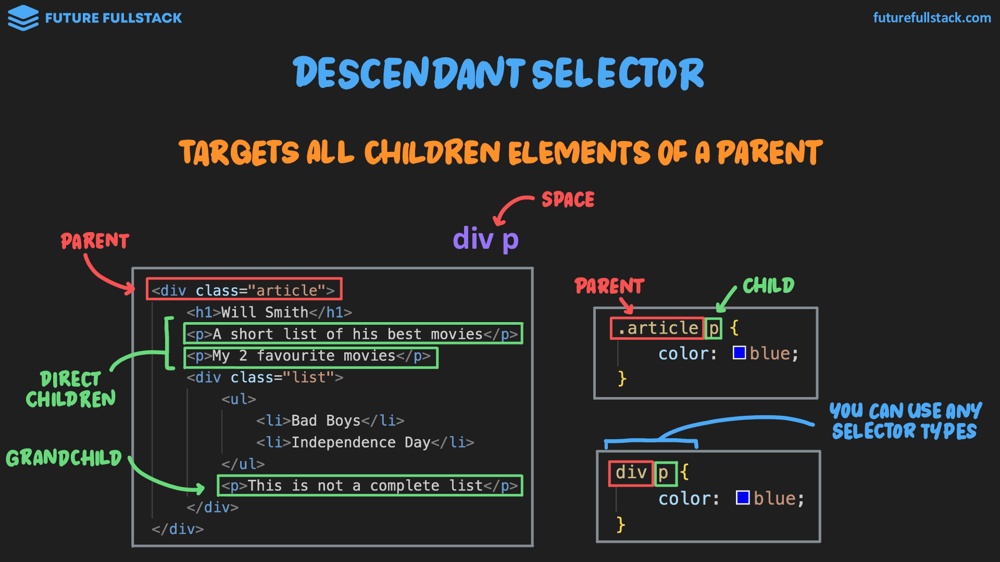
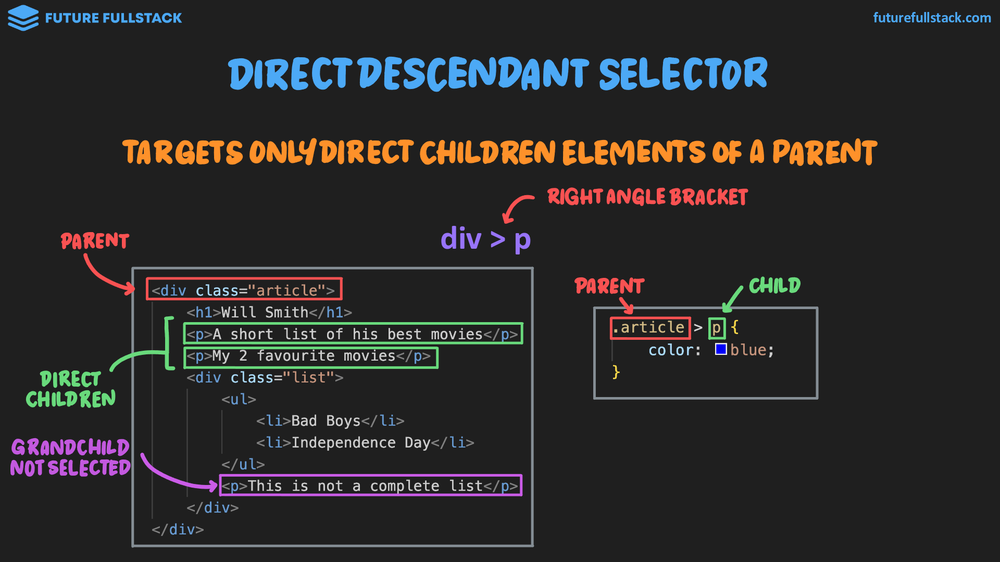
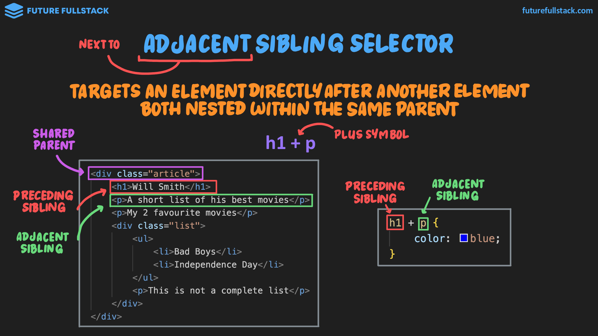
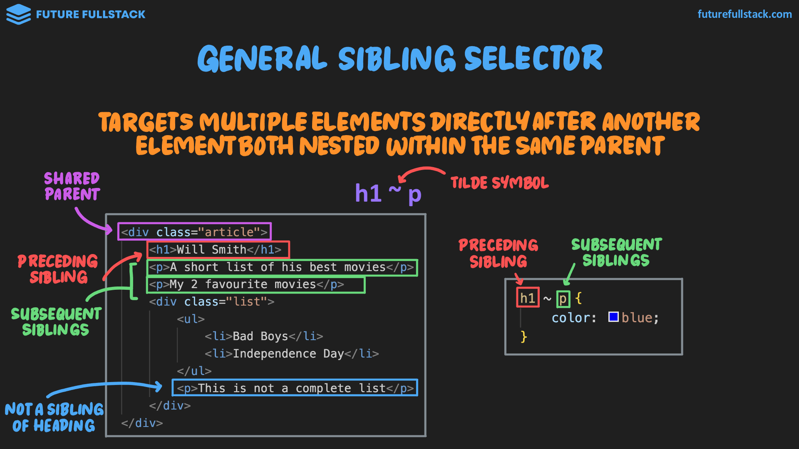

# Pseudo-selectores y especificidad

=== "Pseudo-classes"

    === "Estado"

        Estilizado dinámico basado en la interacción del usuario.

        |Pseudo-clase|Descripción|
        |---|---|
        |`:link`|:lucide-link-2: `#!html <a>` Link que ^^**no** ha sido visitado^^.|
        |`:visited`|:lucide-link-2: `#!html <a>` Link que ^^**sí** ha sido visitado^^.|
        |`:hover`|:lucide-mouse-pointer-square-dashed: `#!html <...>` Cuando el ^^cursor se encuentra encima^^ del elemento.|
        |`:active`|:lucide-mouse-pointer-click: `#!html <...>` Cuando el elemento ^^está siendo clickeado^^{ title="No se ha soltado el botón izquierdo del ratón." }.|

    === "Condición"

        Estilizado basado en la posición de los elementos en relación a otros.

        |Pseudo-clase|Descripción|
        |---|---|
        |`:first-child`|Apunta al ^^primer^^ hijo de un elemento.|
        |`:last-child`|Apunta al ^^último^^ hijo de un elemento.|
        |`:nth-child()`|Apunta a un ^^hijo en particular^^{ title="<code>3</code>: Apuntaría al 3er hijo." } o a ^^cada hijo^^{ title="<code>2n + 1</code>: Apuntaría a cada 2do elemento más 1." } de un elemento.|

=== "Combinator"

    Combina más de un selector para apuntar a elementos basados en sus posiciones relativas entre ellos.

    !!! tip "Consejo"

        El único realmente importante y relativamente más utilizado es el ^^selector de descendientes^^{ title="Descendant Selector" }.

    === ":material-keyboard-space: Descendiente"

        Selecciona todos ^^los elementos hijos^^{ title="Sin importar el nivel de anidamiento" }.

        

    === ":material-chevron-right: Descendiente directo"

        Selecciona todos ^^los elementos hijos **directos**^^{ title="Solo 1 nivel de anidamiento" }.

        

    === ":material-plus: Hermano adyacente"

        Selecciona **un elemento** adyacente a otro, estando ^^ambos anidados^^ dentro de un mismo elemento padre.

        

    === ":material-tilde: Hermano general"

        Selecciona **múltiples elementos** adyacentes a otro, estando ^^todos anidados^^ dentro de un mismo elemento padre.

        

=== "Specificity"

    Determina la prioridad de una regla CSS cuando varias reglas se aplican al mismo elemento.

    !!! tip "Guía"

        - Utiliza el [selector de tipo](./01-basics.md#__tabbed_1_1) para estilos globales.
        - Utiliza el [selector de clase](./01-basics.md#__tabbed_1_4) para anularlos y aplicar estilos específicos.
