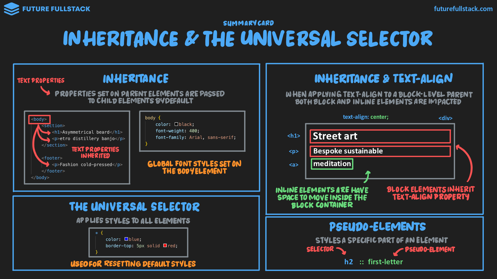

# Selector universal y herencia

=== "Inheritance"

    Propiedades establecidas en elementos padres son heredadas a sus hijos, principalmente texto.

    ??? info "Propiedades heredadas _(texto)_"

        <table>
            <tbody>
                <tr><td>color</td><td>font-weight</td><td>line-height</td></tr>
                <tr><td>font-family</td><td>font-style</td><td>text-align</td></tr>
                <tr><td>font-size</td><td>letter-spacing</td><td>text-transform</td></tr>
            </tbody>
        </table>

    !!! tip "Guía"

        - Los selectores específicos ^^prevalecen^^{ title="La herencia tiene una especificidad de 0, por lo que cualquier selector directo la sobrescribe" } sobre las propiedades heredadas.
        - Las propiedades de fuente globales se definen en el elemento `#!html <body>`.

=== "Inheritance & text-align"

    !!! tip "Guía"

        - La propiedad `text-align` aplicada a un contenedor de bloque afecta a su contenido de dos formas:
            - **Elementos de línea:** Los elementos ^^inline^^{ title="No ocupan todo el ancho, así que el padre puede repartir el espacio vacío a sus lados para centrarlos" } se centran directamente dentro del contenedor.
            - **Elementos de bloque:** Los elementos ^^block^^{ title="Ocupan todo el ancho del contenedor, por lo que heredan la propiedad para alinear su texto interno" } alinean el texto que contienen en su interior.

=== "The Universal Selector"

    Aplica estilos a **todos** los elementos.

    !!! tip "Guía"

        Se utiliza principalmente para ^^reiniciar^^{ title="Eliminar márgenes y rellenos predeterminados de los navegadores para unificar el diseño" } los estilos base.

    |Herencia & Etiqueta `#!html <body>`|Selector universal (`*`)|
    |---|---|
    |Aplica para propiedades de texto.|Aplica en todas las propiedades.|
    |Usado para establecer ^^propiedades de texto^^ por defecto de la aplicación.|Usado para unificar el diseño general mediante ^^propiedades del _box model_^^.|

=== "Pseudo-elements"

    Usados para estilizar una parte específica de un elemento.

    !!! info "Usos"

        |Texto|Selección|Inserción de contenido|
        |---|---|---|
        |`::first-letter`|`::selection`|`::before`|
        |`::first-line`||`::after`|
