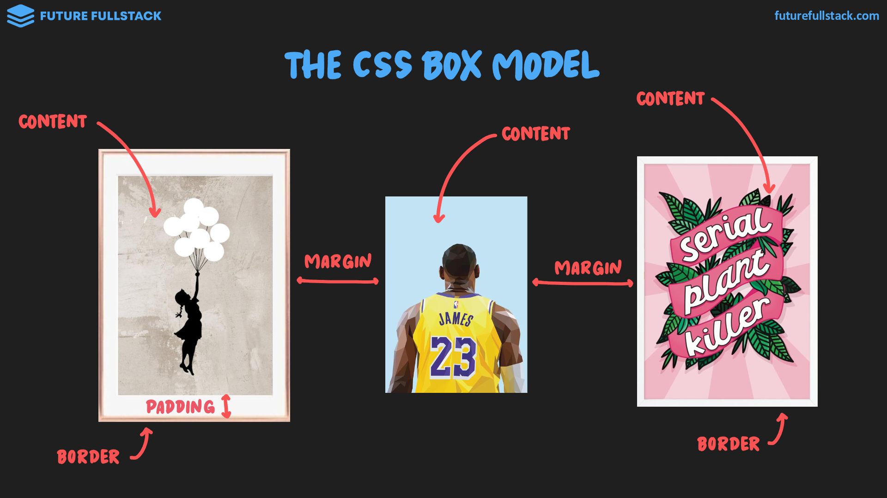
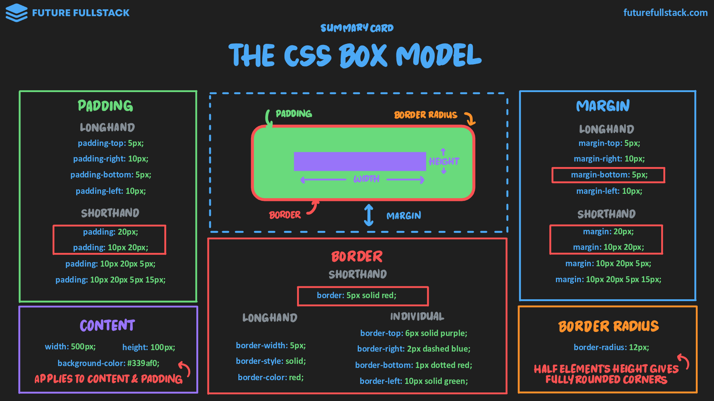
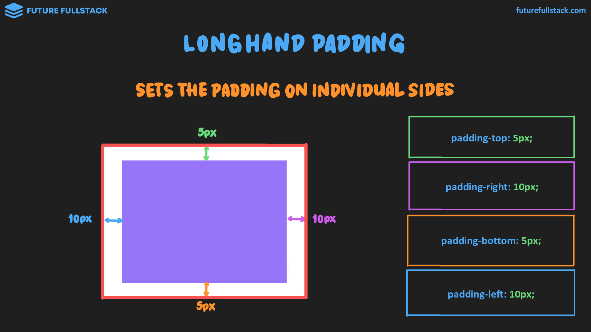
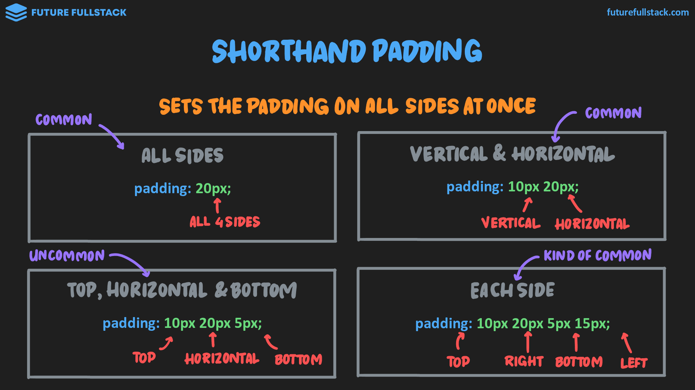
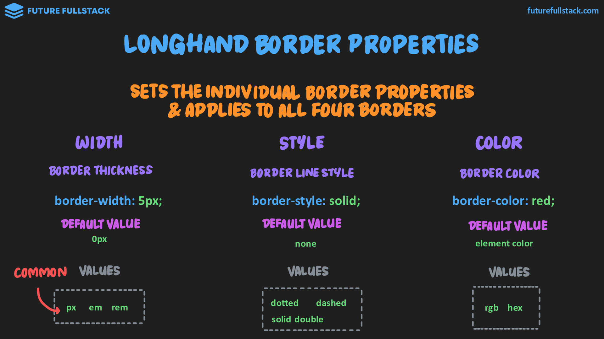
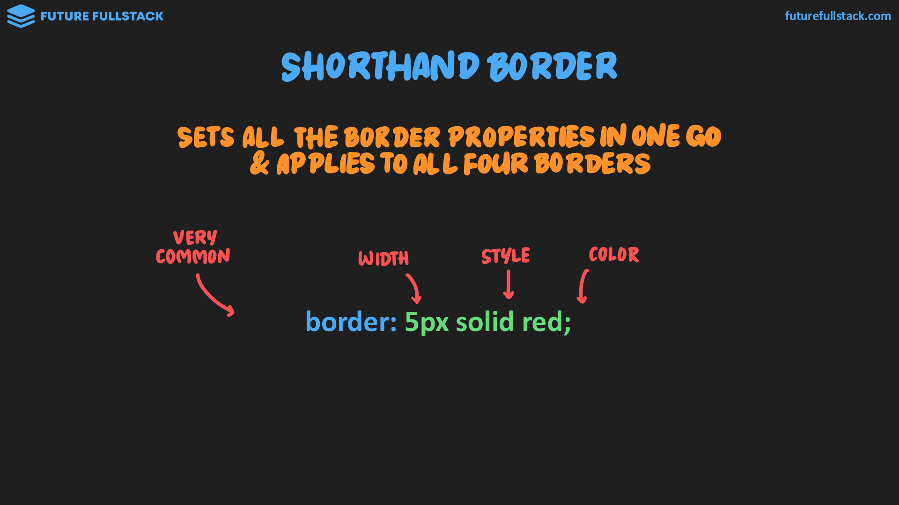
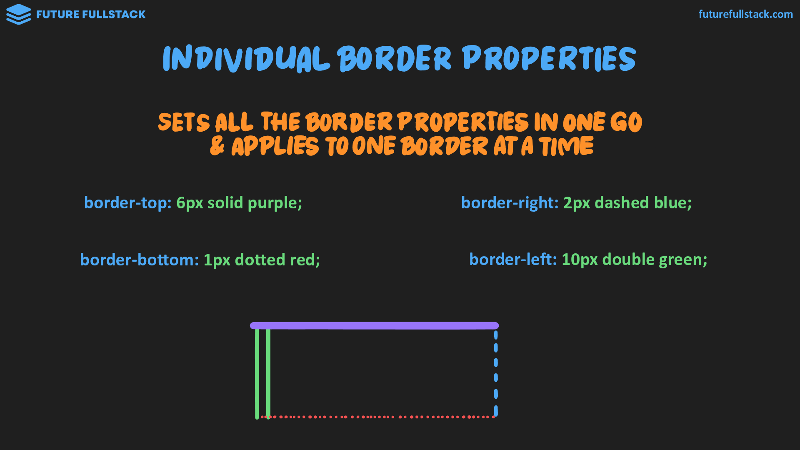
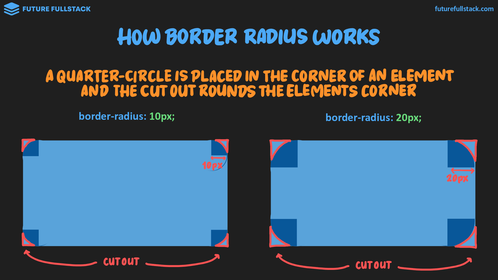
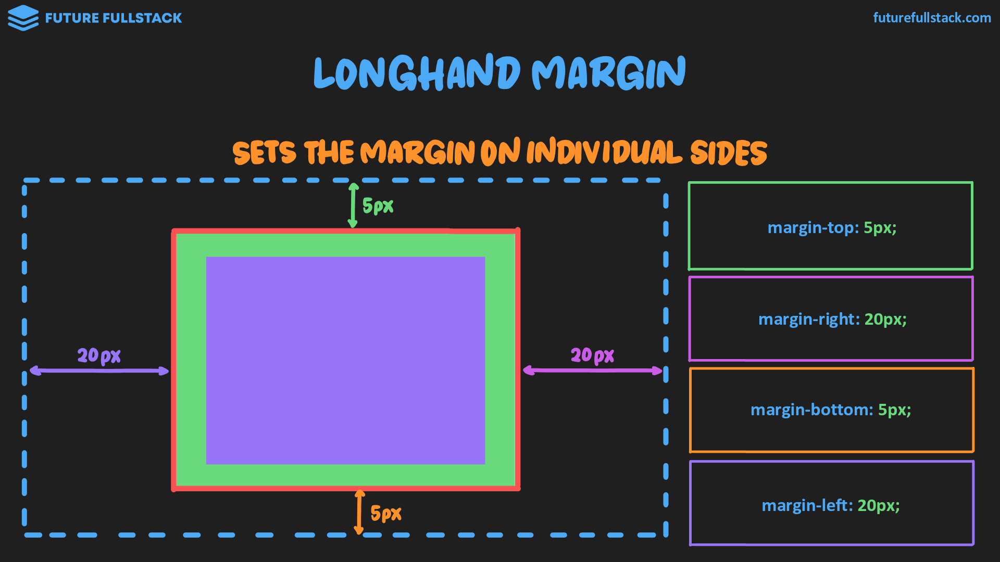
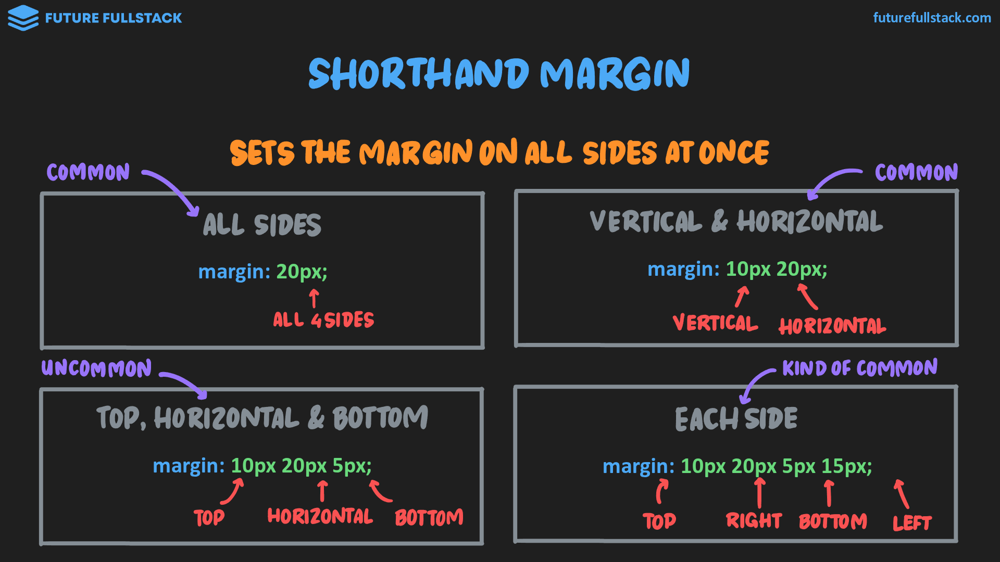

# Box model y propiedades

Todos los elementos HTML son tratados como ^^cajas rectangulares con **propiedades**^^.

??? info "Propiedades"

    - **Contenido:** Texto, imagen o multimedia con ancho (_width_) y alto (_height_).
    - **Relleno:** Espacio interno entre el contenido y el borde.
    - **Borde:** Línea que delimita el elemento.
    - **Margen:** Espacio externo que separa el elemento de los demás.

    



=== "Content"

    === "`background-color`"

        Aplica un color de fondo al contenido y relleno de un elemento.

        !!! tip "Guía de uso"

            - Fondo de secciones de página
            - Componentes (Tarjetas, botones, etc.)

        ```css
        .button--primary {
            background-color: #339af0 /*(1)!*/
        }
        ```

        1. Al igual que `color`, puede tener los siguientes tipos de valores: rgb, hex, rgba y hsl

    === "`width` & `height`"

        Sobreescribe o establece _(en caso de no tener)_ las dimensiones por defecto de un elemento.

        !!! tip "Guía en elementos `block`"

            <table border="1">
                <thead>
                    <tr>
                    <th>Elementos Individuales</th>
                    <th>Elementos Contenedores</th>
                    </tr>
                </thead>
                <tbody>
                    <tr>
                    <td><code>h1</code>, <code>p</code>, <code>ul</code>, <code>li</code></td>
                    <td><code>div</code>, <code>section</code></td>
                    </tr>
                    <tr>
                    <th colspan="2" style="text-align: center;">Altura (Height)</th>
                    </tr>
                    <tr>
                    <td colspan="2">
                        ❌ Por lo general, no se establece la altura, sino que se deja determinar automáticamente por los <strong>márgenes (margins), rellenos (paddings) y tamaño de fuente (font-size)</strong>.
                    </td>
                    </tr>
                    <tr>
                    <th colspan="2" style="text-align: center;">Anchura (Width)</th>
                    </tr>
                    <tr>
                    <td>
                        ❌ Por lo general, no se establece el ancho, el cual se estirará para llenar el contenedor padre.
                    </td>
                    <td>
                        ✅ Dependiendo del diseño (layout), puede ser común establecer un ancho.
                    </td>
                    </tr>
                </tbody>
            </table>

        !!! tip "Guía en elementos `in-line`"

            No siempre[^1] se pueden establecer en estos elementos.

            [^1]: Contenido relacionado: [Replaced inline elements](./02-box-sizing.md#__tabbed_1_2)

            > A veces es necesario usar padding, por ejemplo.

            |✅ Puede aplicarse|❌ No puede aplicarse|
            |---|---|
            |`img`|`span`|
            |`input`|`a`|
            |`select`|`sub`|
            |`textarea`|`sup`|
            |`button`||

        ??? info "Tamaño por defecto"
            - **Elementos `block`:** Tienen la altura justa para albergar su contenido y se extienden a
              todo lo ancho horizontalmente.
            - **Elementos `in-line`:** Tienen el tamaño justo para albergar su contenido, tanto vertical como horizontalmente.

=== "Padding"

    Define el espacio entre el contenido de un elemento y su borde para mejorar la legibilidad y el diseño visual.

    !!! tip "Guía"

        Mejora la legibilidad y diseño de componentes.

        - Botones y callouts.
        - Tarjetas.
        - Entradas de formulario.

        ---

        Se recomienda usar una relación 1:2 (el doble de espacio horizontal respecto al vertical):

        ```css
        .button {
            padding: 15px 30px;
        }
        ```

    Puedes establecer el valor de esta propiedad de 2 formas:

    === "Longhand"

        Establece el relleno en lados individuales.

        

    === "Shorthand"

        Establece el relleno de todos los lados a la vez.

        

=== "Border"

    Define el borde visible alrededor de un elemento HTML y puede mejorar la apariencia visual y la separación con respecto a otros elementos.

    !!! tip "Guía"

        - Agrupa contenido relacionado (i.e. delimitando un componente de tarjeta)
        - Divide secciones
        - Usado para crear botones contorneados

        *[botones contorneados]: En tal caso el botón relleno tendría que tener el mismo borde.

    Puedes establecer el valor de esta propiedad de 2 formas:

    === "Longhand"

        Establece las propiedades individuales de los bordes y se aplica a los cuatro bordes.

        

    === "Shorthand"

        Establece todas las propiedades del borde a la vez y **se aplica a ^^los cuatro bordes^^**.

        

    === "Shorthand individual"

        Establece todas las propiedades del borde a la vez y **se aplica a ^^un borde a la vez^^**.

        

=== "Border radius"

    Define el valor de redondeamiento para el borde

    *[valor de redondeamiento]: px, em, rem, %

    !!! tip "Guía"

        - Las esquinas cuadradas son más formales.
        - Las esquinas redondeadas son percibidas como más amigables.
        - Las esquinas completamente redondas son percibidas como juguetonas.

    ??? info "¿Cómo funciona?"

        Funciona imaginando un **cuarto de círculo** con un radio determinado en cada esquina.

        > **A mayor valor**, más grande es el círculo y más pronunciada la curvatura.

        

=== "Margin"

    Define el espacio situado fuera del borde de un elemento que crea distancia entre este y los elementos adyacentes.

    !!! tip "Guía"

        - Separa grupos de elementos
        - Separa secciones

    Puedes establecer el valor de esta propiedad de 2 formas:

    === "Longhand"

        Establece el margen en lados individuales.

        

    === "Shorthand"

        Establece el margen de todos los lados a la vez.

        
