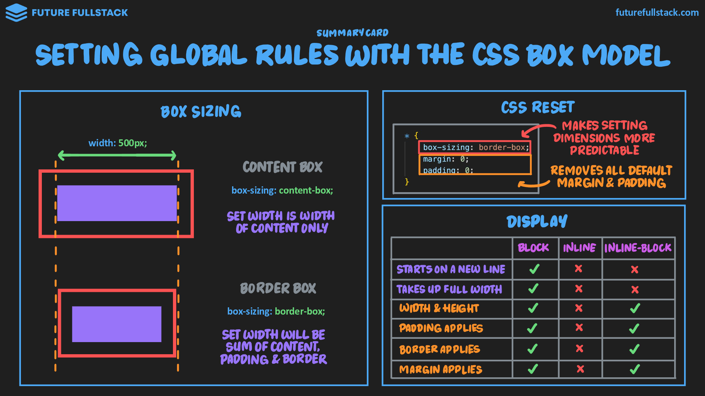
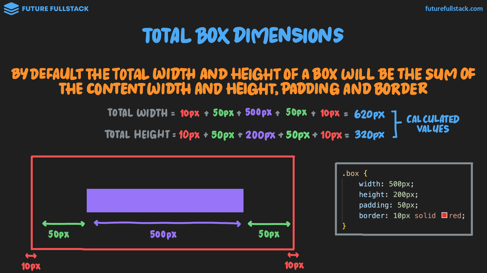
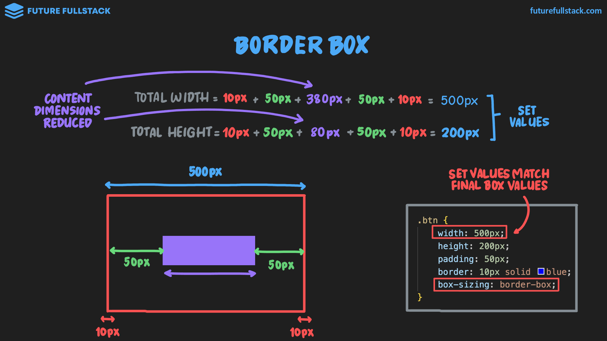
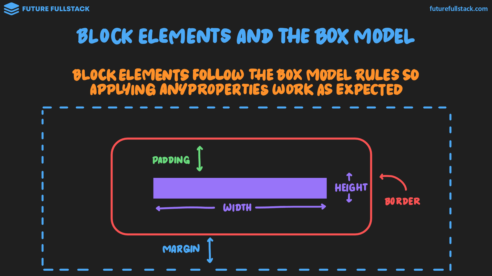
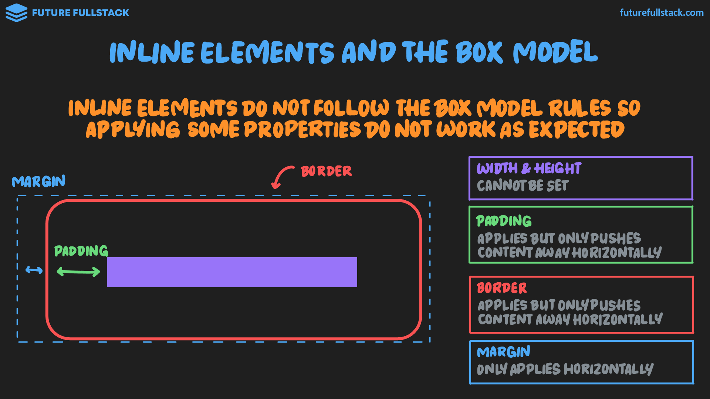
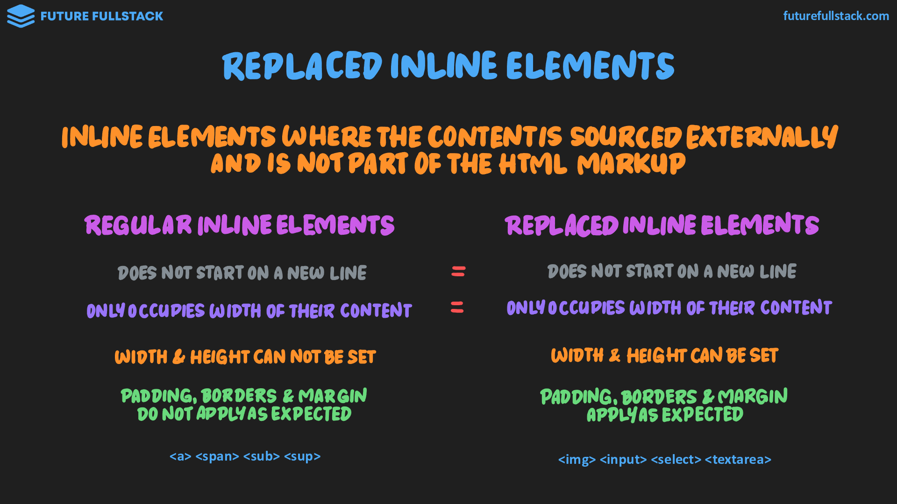

# Box sizing y reglas globales



=== "Box sizing"

    Define cómo se calcula la anchura y la altura totales de un elemento.

    !!! tip "Guía"

        Se recomienda establecer el valor a `border-box` universalmente, para evitar dimensiones impredecibles.

        ```css
        * {
            box-sizing: border-box;
        }
        ```

    === "`content-box`"

        El ancho (_width_) y alto (_height_) ^^se aplican **solo** al contenido^^.

        > El padding y el border se suman al tamaño, haciendo que la caja final sea más grande.

        

    === "`border-box`"

        El ancho (_width_) y alto (_height_) ^^**incluyen** el contenido, padding y border^^.

        > La caja mantiene exactamente el tamaño definido, reduciendo el espacio interno del contenido si es necesario.

        

=== "Display (inline-block)"

    Define cómo se formatea y posiciona el elemento.

    Valores permitidos: `block`, `inline`, **`inline-block`**, `flex` y `grid`.

    ??? info "¿Cómo se aplica el box model en elementos block e inline?"

        |Block|Inline|
        |---|---|
        |**Sí** siguen las reglas del box model.|**No** siguen las reglas del box model.|
        |La aplicación de cualquier propiedad funciona según lo esperado.|La aplicación de ciertas propiedades no produce el resultado esperado.|
        |||

    | Comportamiento | Block | Inline | Inline-Block |
    | :--- | :---: | :---: | :---: |
    | Comienza en una nueva línea | ✅ | ❌ | ❌ |
    | Ocupa todo el ancho | ✅ | ❌ | ❌ |
    | Ancho y alto (Width & Height) | ✅ | ❌ | ✅ |
    | Aplica relleno (Padding) | ✅ | ❌ | ✅ |
    | Aplica borde (Border) | ✅ | ❌ | ✅ |
    | Aplica margen (Margin) | ✅ | ❌ | ✅ |

    !!! tip "Guía de inline-block"

        Mantiene la naturaleza `inline` del elemento, **permitiendo aplicar todas las propiedades del box model**.

        - Usado en botones para aplicar borde, margen y padding.
        - Usado en `#!html <span>` cuando se necesita resaltar algo de forma llamativa.

    ??? note "Replaced inline elements"

        Elementos en línea cuyo contenido proviene de una fuente externa y no forma parte del marcado HTML.

        <figure markdown="span">

        

        <figcaption>Contenido relacionado: [Guía en elementos in-line](./01-box-model.md#__tabbed_2_2)</figcaption>

        </figure>

=== "CSS Reset"

    === "Reset"

        Una forma de ^^disponer de un lienzo en blanco^^ al **eliminar los estilos predeterminados** del navegador.

        ```css title="Global Resets"
        * {
            box-sizing: border-box;
            margin: 0;
            padding: 0;
        }
        ```

        ```css title="Element Resets"
        a {
            text-decoration: none;
            display: inline-block;
        }

        ul, ol {
            list-style: none;
        }
        ```

    === "Normalize"

        Una forma de crear una ^^experiencia uniforme en múltiples navegadores^^ mediante **estilos predeterminados**, sin eliminar todos los estilos, como lo hace un _«reset»_.

        !!! tip "Guía"

            Prefiere usar algún tipo de normalización sobre el reset.

            Ejemplo popular: [Modern Normalize](https://github.com/sindresorhus/modern-normalize)
