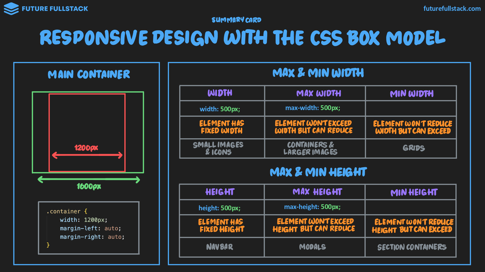
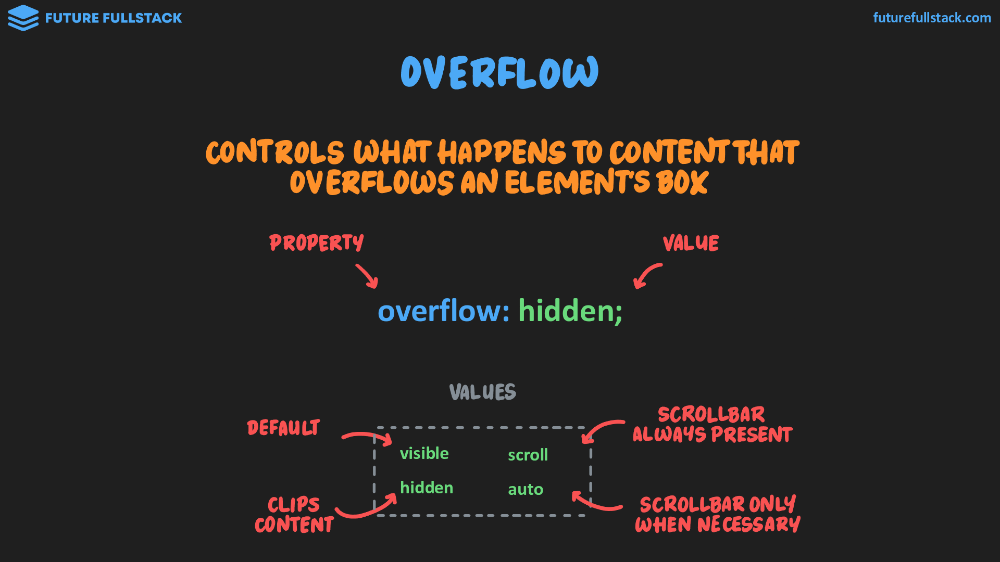
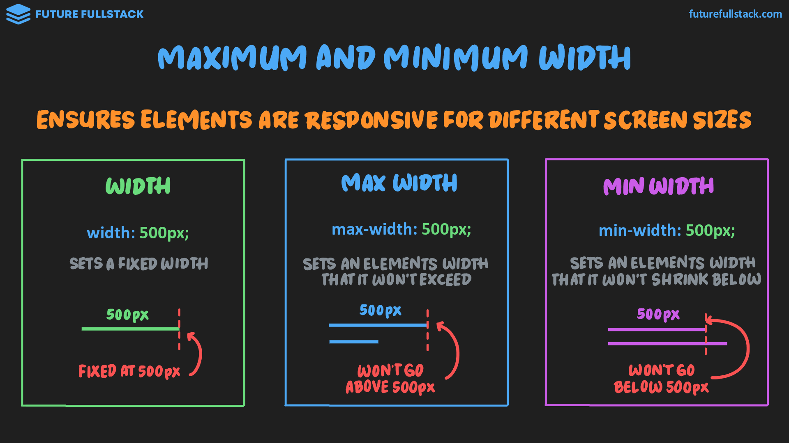
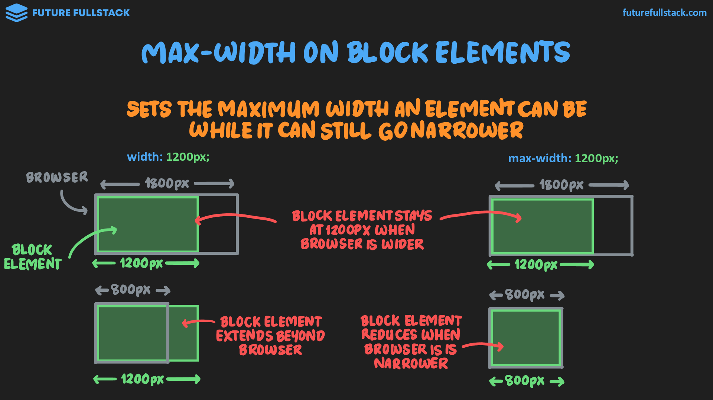
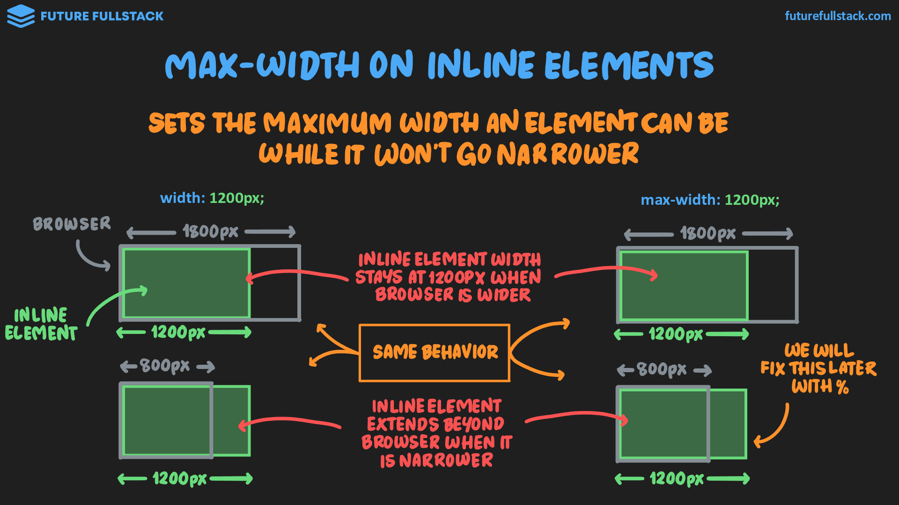
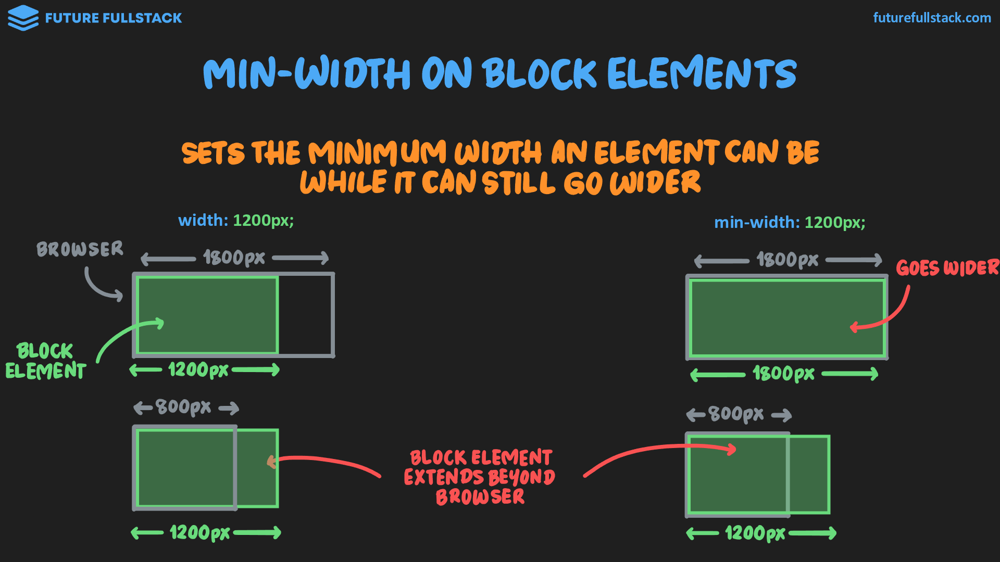
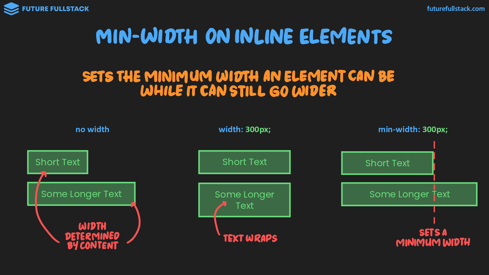
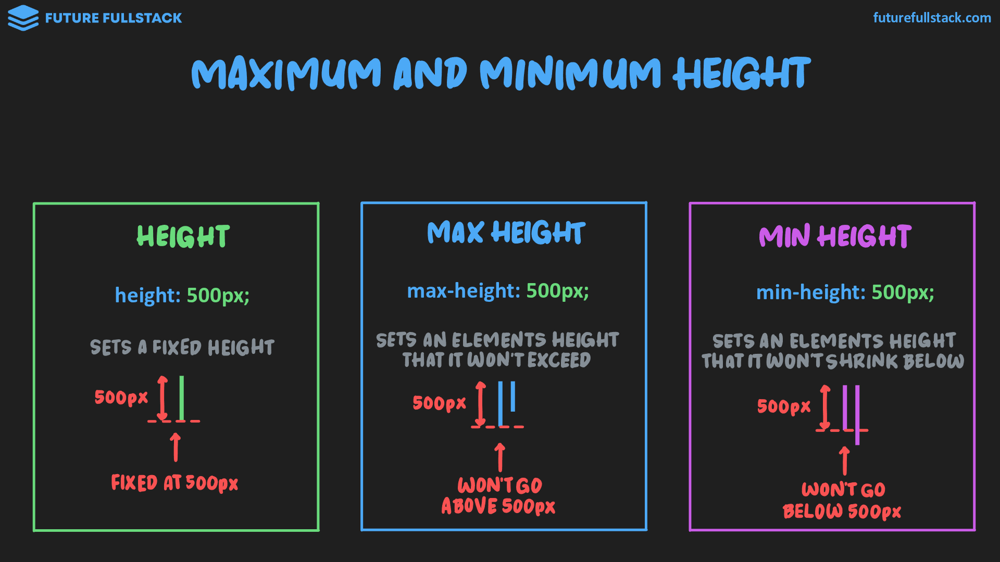
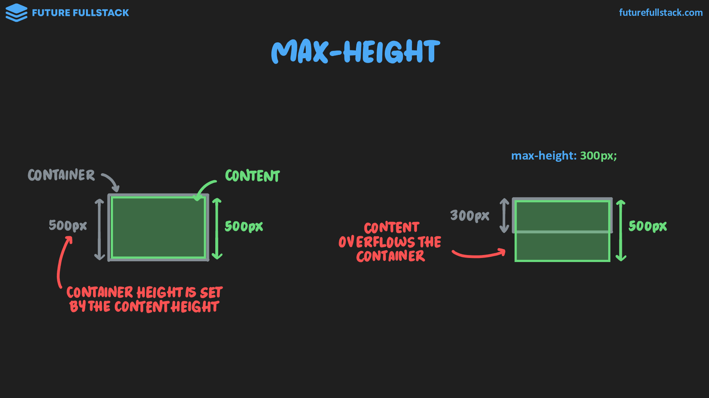
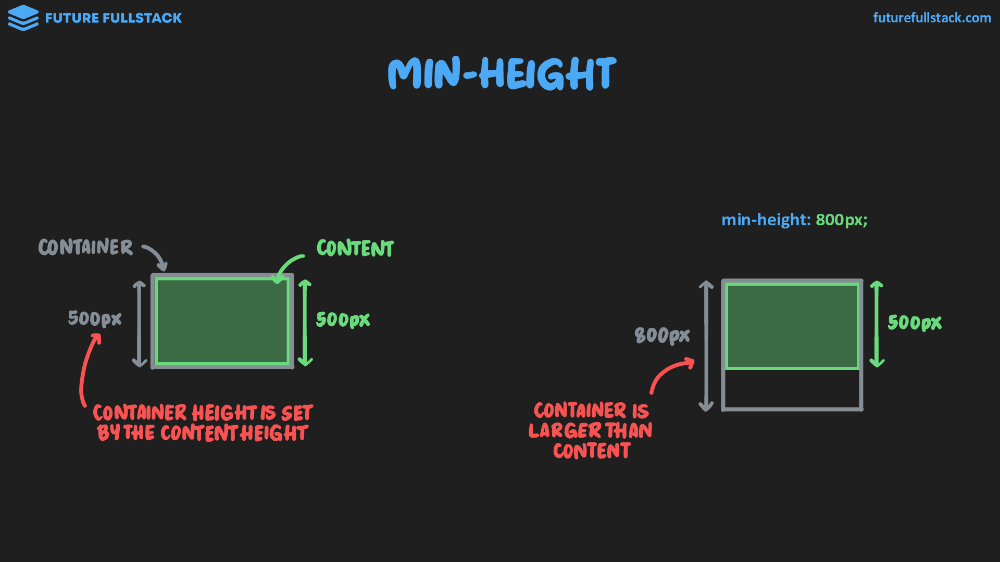

# Diseño adaptativo



??? tip "Desbordamiento: `overflow`"

    Controla qué sucede con el contenido que desborda la caja de un elemento.

    

=== "Main container"

    Contenedor que aplica márgenes a la izquierda y derecha y mantiene todo el contenido centrado.

    !!! tip "Guía"

        Se define un ancho límite para evitar que las líneas de texto e imágenes se estiren de forma excesiva e incómoda en monitores grandes.

    ??? info "Valor `auto`"

        Un valor que permite al navegador determinar automáticamente el tamaño de una propiedad.

        === "Imágenes"

            Se aplica automáticamente a la otra dimensión al establecer la anchura o la altura, preservando la relación de aspecto.

            ```css
            .img {
                width: 400px;
                height: auto;
            }
            ```

        === "Margen"

            Calcula automáticamente el espacio restante dentro de un contenedor padre y se utiliza para centrar un contenedor hijo.

            ```css title="Longhand"
            .container {
                width: 1200px;
                margin-left: auto;
                margin-right: auto;
            }
            ```

            ```css title="Shorthand"
            .container {
                width: 1200px;
                margin: 0 auto;
            }
            ```

=== "Max/Min width"

    !!! success "Más utilizados debido al papel que desempeñan en la creación de diseños adaptativos."

    Garantiza que los elementos se adapten a diferentes tamaños de pantallas.

    

    **Resumen de comportamiento**

    <table border="1">
        <thead>
            <tr>
                <th>:lucide-code-2: Prop</th>
                <th>:lucide-text: Descripción</th>
                <th>:lucide-eye: Vista</th>
                <th>:lucide-image-upscale: Comportamiento</th>
                <th>:lucide-play: Ejemplo</th>
            </tr>
        </thead>
        <tbody>
            <tr>
                <td rowspan="2"><code>width</code></td>
                <td rowspan="2">Establece un ancho fijo</td>
                <td><code>block</code></td>
                <td rowspan="2"><u>Permanece fijo</u> cuando el tamaño de la pantalla se reduce o aumenta</td>
                <td>Sidebar</td>
            </tr>
            <tr>
                <td><code>inline</code></td>
                <td>Imágenes pequeñas e iconos</td>
            </tr>
            <tr>
                <td rowspan="2"><code>max-width</code></td>
                <td rowspan="2">Establece la anchura que un elemento no superará</td>
                <td><code>block</code></td>
                <td><u>Se encoge</u> cuando el tamaño de la pantalla se reduce</td>
                <td>Contenedores</td>
            </tr>
            <tr>
                <td><code>inline</code></td>
                <td><u>No se encoge</u> cuando el tamaño de la pantalla se reduce</td>
                <td>Imágenes</td>
            </tr>
            <tr>
                <td rowspan="2"><code>min-width</code></td>
                <td rowspan="2">Establece la anchura mínima por debajo de la cual un elemento no se reducirá</td>
                <td><code>block</code></td>
                <td><u>Se expande</u> cuando el tamaño de la pantalla se incrementa</td>
                <td>Secciones con Grid</td>
            </tr>
            <tr>
                <td><code>inline</code></td>
                <td>El contenido <u>no pasa a la siguiente línea</u></td>
                <td>Tags</td>
            </tr>
        </tbody>
    </table>

    ??? info "Comportamiento"

        === "`max-width`"

            === "`block`"

                Establece la anchura máxima que puede tener el elemento, **permitiendo que se encoja** en pantallas más pequeñas.

                - **Navegador grande (1800px):** Mantiene los 1200px.
                - **Navegador pequeño (800px):** Se reduce a 800px sin desbordar.

                

            === "`inline`"

                !!! tip "Solución _Responsive_"

                    Para evitar que el elemento se desborde en pantallas pequeñas, se suele combinar con `width: 100%`.

                Establece la anchura máxima que puede tener el elemento, **NO permitiendo que se encoja** en pantallas más pequeñas.

                - **Navegador grande (1800px):** Mantiene los 1200px.
                - **Navegador pequeño (800px):** Mantiene los 1200px y desborda la pantalla.

                

        === "`min-width`"

            === "`block`"

                Establece la anchura mínima que puede tener el elemento, **permitiendo que se expanda** si el contenido lo requiere.

                - **Navegador grande (1800px):** Crece y se expande hasta ocupar los 1800px.
                - **Navegador pequeño (800px):** Mantiene su mínimo (1200px) y desborda la pantalla, provocando scroll horizontal.

                

            === "`inline`"

                Establece la anchura mínima que puede tener el elemento, **permitiendo que se expanda** si el contenido lo requiere.

                - **Sin width:** El ancho depende únicamente de la longitud del texto.
                - **Con `width: 300px`:** El ancho es fijo a 300px y fuerza al texto largo a saltar de línea (*wrap*).
                - **Con `min-width: 300px`:** El texto corto mantiene los 300px mínimos, pero si el texto es más largo, el elemento **crece horizontalmente** sin romper la línea.

                

=== "Max/Min height"

    !!! warning "Menos utilizado que max/min width."

    Garantiza que los elementos se adapten a diferentes tamaños de pantallas.

    

    **Resumen de comportamiento**

    <table border="1">
        <thead>
            <tr>
                <th>:lucide-code-2: Prop</th>
                <th>:lucide-text: Descripción</th>
                <th>:lucide-eye: Vista</th>
                <th>:lucide-image-upscale: Comportamiento</th>
                <th>:lucide-play: Ejemplo</th>
            </tr>
        </thead>
        <tbody>
            <tr>
                <td rowspan="2"><code>height</code></td>
                <td rowspan="2">Establece una altura fija</td>
                <td><code>block</code></td>
                <td rowspan="2"><u>Permanece fija</u> cuando el tamaño de la pantalla se reduce o aumenta en altura</td>
                <td>Navbar</td>
            </tr>
            <tr>
                <td><code>inline</code></td>
                <td>Imágenes pequeñas e iconos</td>
            </tr>
            <tr>
                <td><code>max-height</code></td>
                <td>Establece la altura que un elemento no superará</td>
                <td><code>block</code></td>
                <td><u>Limita la altura del contenido</u> y se produce un desbordamiento si el contenido supera el valor</td>
                <td>Modal</td>
            </tr>
            <tr>
                <td><code>min-height</code></td>
                <td>Establece la altura mínima por debajo de la cual un elemento no se reducirá</td>
                <td><code>block</code></td>
                <td><u><b>El contenedor</b> puede ampliarse</u> si el contenido tiene una altura inferior al valor mínimo</td>
                <td>Contenedores de secciones</td>
            </tr>
        </tbody>
    </table>

    ??? info "Comportamiento"

        === "`max-height`"

            Establece la altura máxima que puede tener el elemento, **permitiendo que pueda adaptarse a contenidos más pequeños**.

            - **Sin límite de altura:** La altura del contenedor se adapta al tamaño del contenido (500px).
            - **Con `max-height: 300px`:** El contenedor se limita a 300px y el contenido que supera ese límite (500px) desborda el contenedor (*overflow*).

            

            ??? info "Max width vs Min height"

                |`max-width`|`max-height`|
                |---|---|
                |Se basa en su contenedor, por lo que se aplica incluso sin contenido|Solo se aplica cuando el contenido supera el límite|

        === "`min-height`"

            Establece la altura mínima que puede tener el elemento, **permitiendo que se expanda si el contenido lo requiere**.

            - **Sin límite de altura:** La altura del contenedor depende únicamente del tamaño de su contenido (500px).
            - **Con `min-height: 800px`:** El contenedor respeta el mínimo fijado (800px) y queda más grande que el contenido (500px), garantizando un tamaño base.

            
