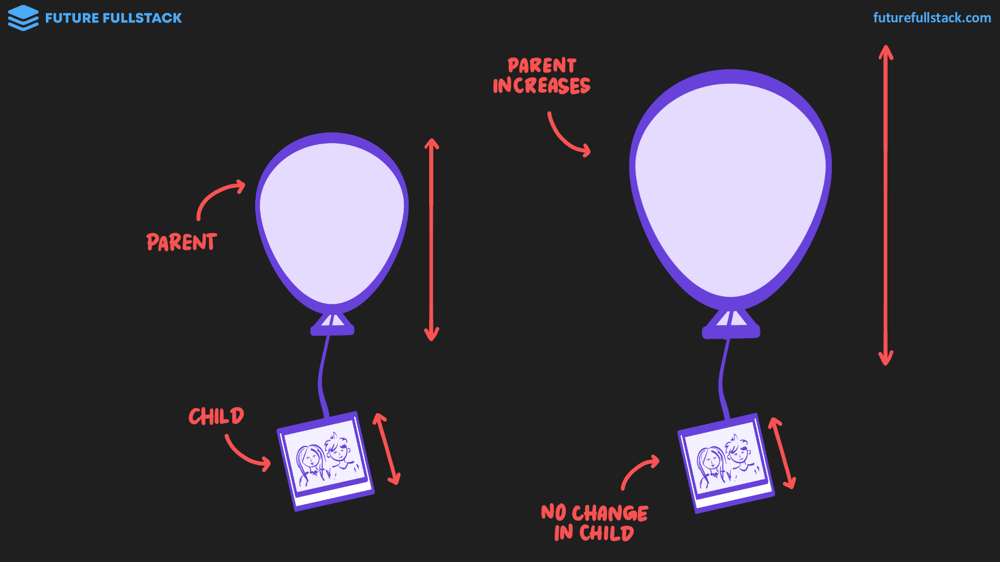
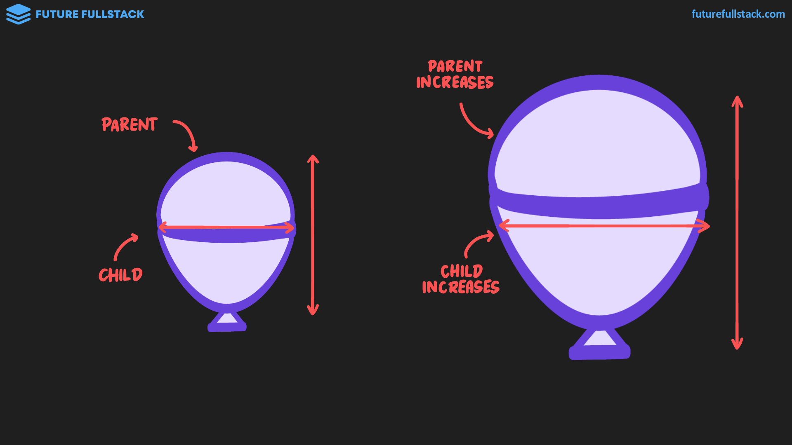
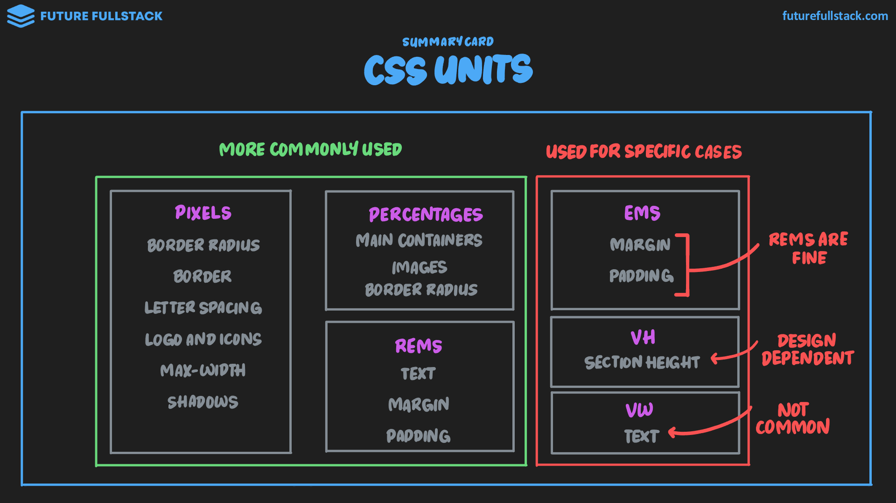
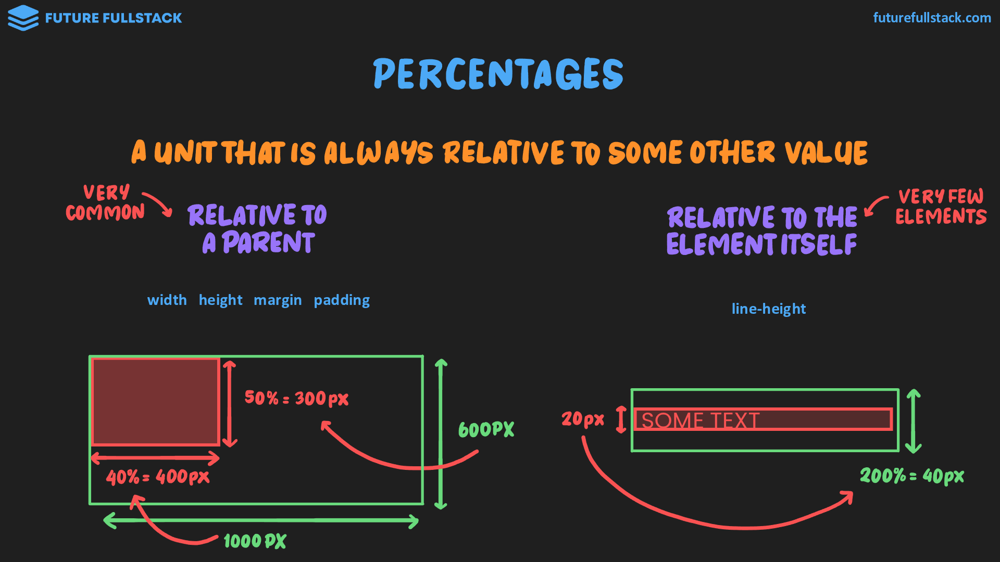
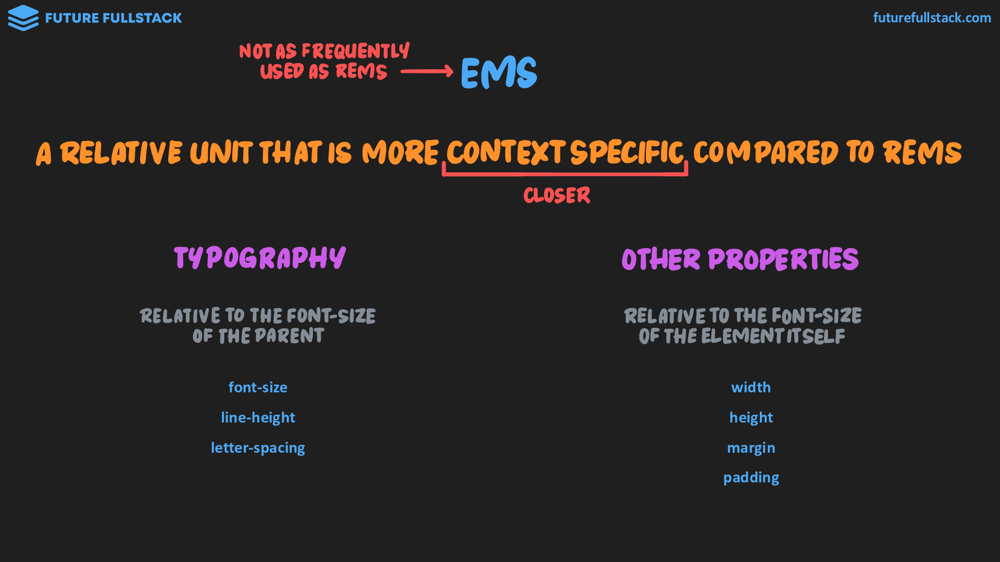
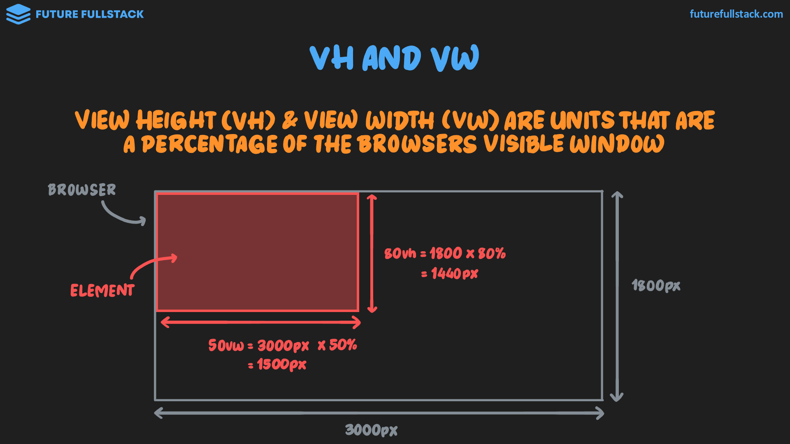

# Unidades

??? info "Absolutas vs Relativas"

    Las unidades relativas son esenciales para las páginas web adaptables, ya que permiten que los elementos se ajusten dinámicamente a diferentes tamaños de pantalla.

    |:lucide-ruler: Absolutas|:lucide-percent: Relativas|
    |---|---|
    |El tamaño es **fijo** y no cambia en relación con los elementos padres.|El tamaño **se basa en el tamaño de un elemento padre** y se ajusta proporcionalmente a los cambios en dicho elemento.|
    |||
    |**`px`**, `pt`, `in`, `cm`, `mm`|`%`, `em`, `rem`, `vh`, `vw`|

=== "Percentages"

    Unidad que siempre es relativa a algún otro valor: por lo general el elemento padre.

    ??? info "Relativa al padre vs Relativa a sí mismo"

        

    !!! tip "Guía de uso"

        Usado para que la página web sea totalmente adaptable (responsive).

        - **Contenedores principales:** Junto con `max-width`.
        - **Imágenes independientes:** Junto con `max-width`.
        - **Imágenes dentro de un _contenedor grid o flex_:** Al 100% para que ocupen toda la celda.
        - **Ancho de un botón:** Al 100% para que llene su contenedor.
        - **Esquinas totalmente redondeadas**

        **Resumen**

        |&nbsp;|`max-width`|< 100%|100%|50%|
        |---|:-:|:-:|:-:|:-:|
        |**Contenedor principal**|✅|✅|||
        |**Imagen independiente**|✅||✅||
        |**Imagen en grid**|||✅||
        |**Botón de ancho completo**|||✅||
        |**Esquinas redondas**||||✅|

=== "`rem` & `em`"

    - REM: Unidad relativa al **tamaño de la fuente** del ^^elemento raíz `#!html <html>`^^.
    - EM: Unidad relativa al **tamaño de la fuente** del elemento padre o de sí mismo.

    !!! tip "Guía de uso"

        - **Rem:** Comúnmente usados en texto, márgenes y padding.
        - **Em:** Puede ser completamente ignorado o usado en casos específicos como padding en botones.

    

=== "`vh` & `vw`"

    Unidades relativas a la altura (`vh`) y la anchura (`vw`) de la ventana del navegador.

    !!! tip "Guía de uso"

        - **_Hero sections_:** `vh` + `min-height` para garantizar que el contenido siempre aparezca en la parte visible de la página.
        - **Texto independiente:** `vw` para crear texto adaptable que no está confinado a un contenedor.

    
