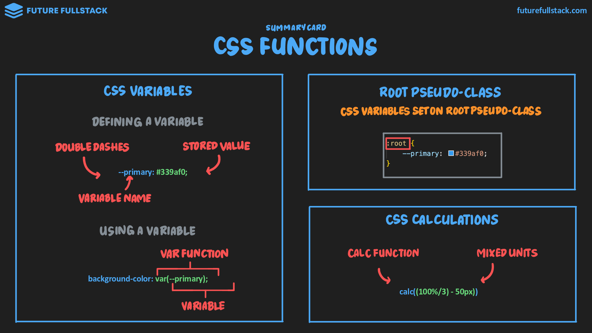

# Funciones y variables



=== "Variables"

    Nos permite almacenar valores. Facilita el mantenimiento y realizar cambios globales con mayor facilidad.

    !!! tip "Guía de uso"

        Son declarados en el la pseudo-clase `:root`

        ```css
        :root {
            --primary: #339af0
        }
        ```

        Y utilizados por medio de la función `var()`

        ```css
        :root {
            .highlight-primary {
                background-color: var(--primary);
            }
        }
        ```

=== "Calculations"

    Realiza cálculos dinámicos al establecer valores.

    !!! tip "Guía de uso"

        Es común utilizar variables y cálculos en combinación.

        ```css
        :root {
            --text-h1: 50px
        }

        h1 {
            font-size: calc(var(--text-h1) + 10vh)
        }
        ```
