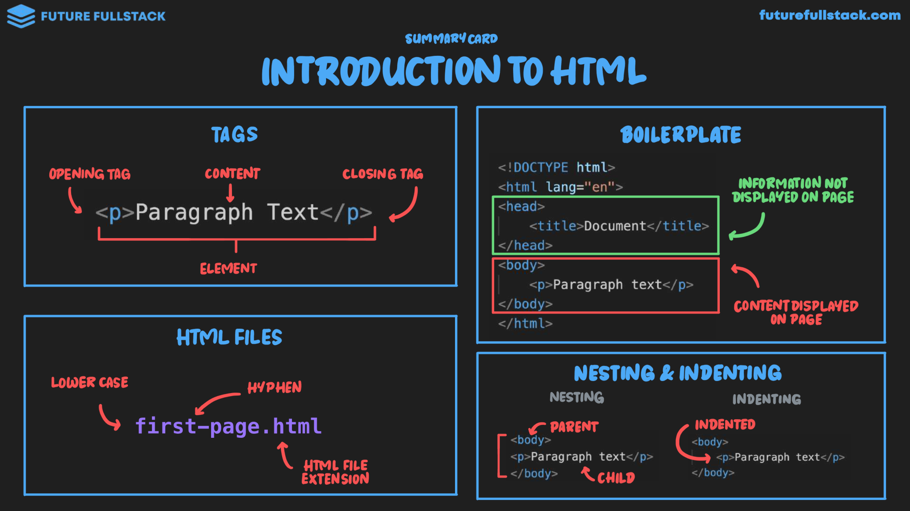

# Introducción



=== "Tags"

    Un elemento HTML está compuesto por etiquetas de apertura, contenido y etiquetas de cierre.

    ```html title="Estructura de una etiqueta"
    <p>Paragraph Text</p>
    ```

    - **Etiqueta de apertura:** `<p>`
    - **Content:** `Paragraph Text`
    - **Etiqueta de cierre:** `</p>`
    - **Elemento:** Todo el conjunto combinado.

=== "HTML Files"

    Convenciones para nombrar archivos HTML:

    - Usar siempre minúsculas (**lower case**).
    - Usar guiones (**hyphen**) para separar palabras.
    - Extensión obligatoria: `.html`

    *Ejemplo:* `first-page.html`

=== "Boilerplate Structure"

    ```html title="Estructura básica de un archivo HTML"
    <!DOCTYPE html>
    <html lang="en">
    <head> <!-- (1)! -->
        <title>Document</title>
    </head>
    <body> <!-- (2)! -->
        <p>Paragraph text</p>
    </body>
    </html>
    ```

    1.  Información no visible en la página
    2.  Contenido mostrado en la página

=== "Nesting & Indenting"

    - **Nesting (Anidación):** Los elementos dentro de otros se consideran elementos **hijos** (`Child`), mientras que el contenedor es el **padre** (`Parent`).
    - **Indenting (Indentación):** Los elementos hijos deben indentarse (normalmente 2 o 4 espacios) para mejorar la legibilidad.
