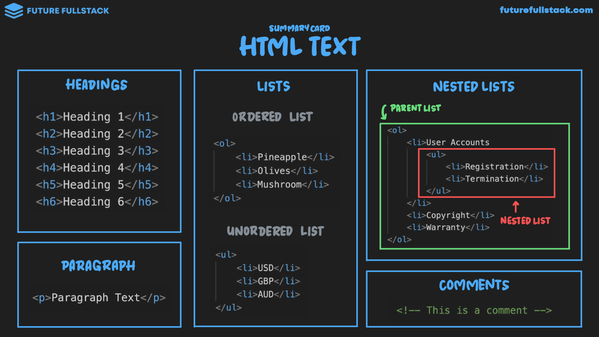

# Texto



=== "Headings"

    Los encabezados definen la jerarquía del texto de mayor a menor importancia.

    !!! tip "Tip"

        - Usar `#!html <h1></h1>` solo una **vez por página**, normalmente para el ^^título principal^^.
        - Usar `#!html <h2></h2>` para **agrupar** ^^contenido relacionado^^.
        - Usar `#!html <h3></h3>` para los **subtítulos** de las ^^subsecciones^^.

    ```html
    <h1>Encabezado 1</h1>
    <h2>Encabezado 2</h2>
    <h3>Encabezado 3</h3>
    <h4>Encabezado 4</h4>
    <h5>Encabezado 5</h5>
    <h6>Encabezado 6</h6>
    ```

=== "Paragraphs"

    Agrupa texto relacionado en un solo bloque de contenido.

    ```html title="Párrafo"
    <p>Paragraph Text</p>
    ```

=== "Lists & Nested Lists"

    !!! tip "Tip"

        También se utilizan para agrupar elementos HTML relacionados:

        - Elementos de navegación (Navbar & Sidebar).
        - Botones.
        - Iconos y enlaces de redes sociales.

    === "Ordered List"
        ```html
        <ol>
            <li>Pineapple</li>
            <li>Olives</li>
            <li>Mushroom</li>
        </ol>
        ```

    === "Unordered List"
        ```html
        <ul>
            <li>USD</li>
            <li>GBP</li>
            <li>AUD</li>
        </ul>
        ```

    === "Nested Lists"
        ```html
        <ol>
            <li>User Accounts
                <ul>
                    <li>Registration</li>
                    <li>Termination</li>
                </ul>
            </li>
            <li>Copyright</li>
            <li>Warranty</li>
        </ol>
        ```

=== "Comments"

    Se pueden utilizar como:

    - Recordatorios para el desarrollador.
    - Desactivación temporal de código HTML.
    - Documentación de código HTML.

    ```html title="Comentario"
    <!-- Esto es un comentario -->
    ```
