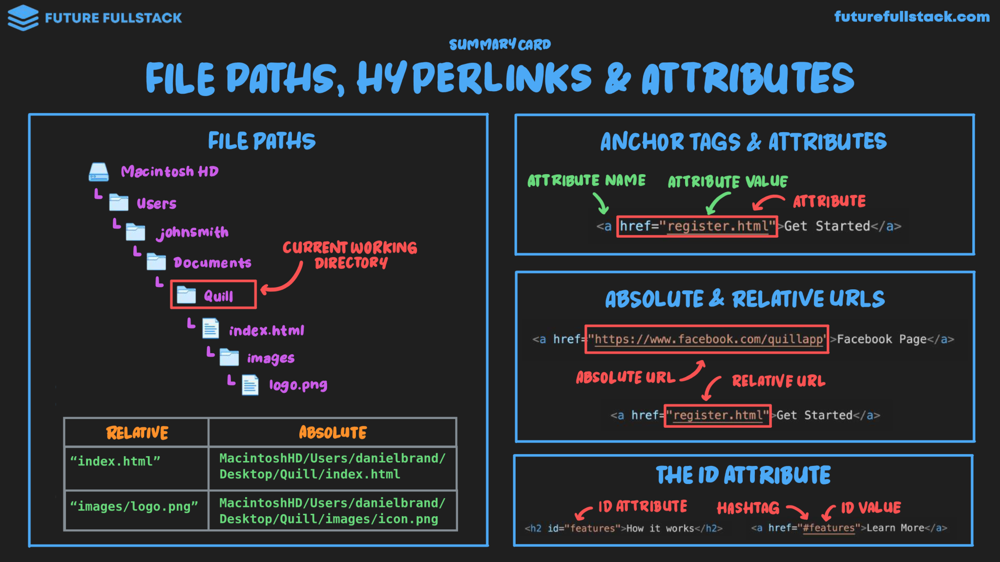

# Rutas de archivo, hipervínculos y atributos



=== "Anchor Tags & Attributes"

    Los atributos proporcionan información adicional a las etiquetas mediante pares de `nombre="valor"`.

    ```html
    <a href="register.html">Get Started</a>
    ```

    - **Nombre del atributo:** `href`
    - **Valor del atributo:** `register.html`

=== "Absolute vs Relative URLs"

    - **URL Absoluta:** Dirección completa en la web.
        ```html
        <a href="https://www.facebook.com/quillapp">Facebook Page</a>
        ```
    - **URL Relativa:** Enlace a un archivo dentro del mismo proyecto.
        ```html
        <a href="register.html">Get Started</a>
        ```

=== "The ID Attribute"

    Se utiliza para asignar un identificador único que permite vincular o dar estilo a un elemento.

    ```html
    <h2 id="features">How it works</h2>
    <a href="#features">Learn More</a>
    ```
