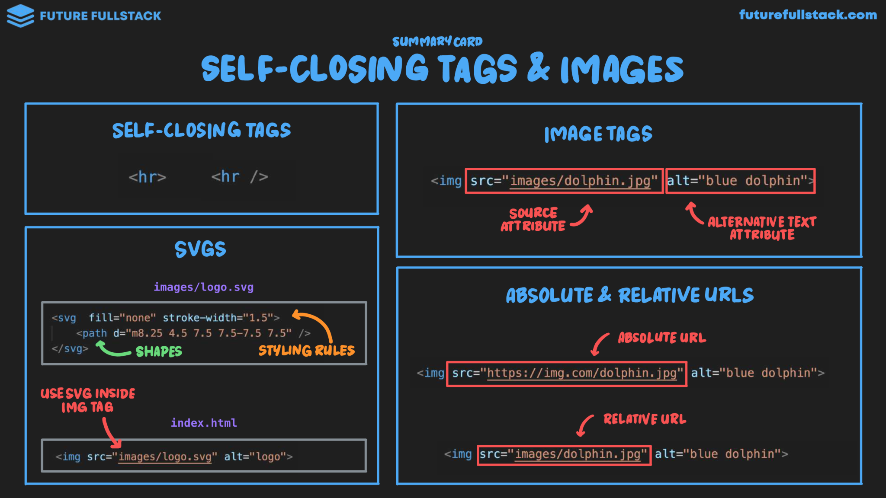

# Imagenes y Etiquetas Autocerradas



!!! info "Etiquetas de autocierre"
    Etiquetas que no contienen texto de cierre explicito como `#!html <hr>` o `#!html <hr />`.

=== "Images"

    ```html
    
    ```

    - **src:** Ruta o fuente de la imagen.
    - **alt:** Texto alternativo de descripción.

=== "SVGs"

    Se pueden usar directamente mediate código vectorial o dentro de etiquetas ``:

    ```html
    <!-- SVG Inline -->
    <svg fill="none" stroke-width="1.5">
        <path d="m8.25 4.5 7.5 7.5-7.5 7.5" />
    </svg>

    <!-- SVG en img -->
    
    ```
