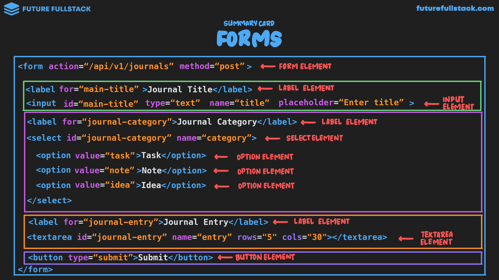

# Formularios

Recopilan y envían datos proporcionados por el usuario a un servidor web para su procesamiento.



??? info "Envío del formulario"

    El servidor recibe un par clave-valor de los campos del formulario:

    - La **clave** es el atributo `name` del elemento
    - El **valor** es el contenido ingresado por el usuario.

    ```html
    <input type="..." name="username"> <!-- (1)! -->
    ```

    1. Si el usuario ingresa "John_Doe", el servidor recibirá lo siguiente:
       ```properties
       username=John_Doe
       ```

=== "Form Tag"

    Actuá como un contenedor para los elementos que permiten a los usuarios ingresar diferentes tipos de datos.

    ```html
            <!-- (1)! -->                 <!-- (2)! -->
    <form action="submit.php" method="post">
    </form>
    ```

    1.  El **dónde**

        Especifica la ruta del servidor a la que se enviarán los datos para su procesamiento.

        !!! example "Ejemplo"

            ```
            /api/v1/journals
            ```

    2.  El **cómo**

        Determina el método HTTP utilizado para procesar los datos del formulario.

        !!! example "Ejemplo"

            - `GET`
            - `POST`
            - `PUT`
            - `DELETE`
            - `PATCH`

=== "Label"

    Proporciona una descripción para los elementos del formulario, además, mejora la
    accesibilidad y la usabilidad de este.

    ```html hl_lines="1"
    <label for="journal-title">Journal Title</label> <!-- (1)! -->
    <input id="journal-title" ...>
    ```

    1.  La propiedad `for` vincula la etiqueta con el elemento del formulario correspondiente
        mediante su atributo `id`.

        Esto permite que al hacer clic en la etiqueta, el foco se mueva al campo de entrada asociado.

=== "Inputs"

    ??? info "Tipos"

        |Textual |Binario |Archivo|Misceláneo|
        |--------|--------|-------|----------|
        |Text    |Checkbox|File   |Range     |
        |Password|Radio   |       |Color     |
        |Email   |        |       |          |
        |Date    |        |       |          |
        |Tel     |        |       |          |
        |Number  |        |       |          |

    ```html
    <input type="text" name="title" placeholder="Enter title">
    ```

    - **Tipo _(type)_:** Define el tipo de entrada (texto, correo electrónico, contraseña, etc.).
    - **name:** Nombre del campo que se enviará al servidor.
    - **placeholder:** Texto de sugerencia dentro del campo.

    === "Checkbox"

        Permite al usuario seleccionar una o varias opciones de un conjunto de opciones.

        ```html
        <input id="topping-1" type="checkbox" name="pinapple"> <!-- (1)! -->
        <label for="topping-1">Pinapple</label>

        <input id="topping-3" type="checkbox" name="olives" value="olives_chosen"> <!-- (2)! -->
        <label for="topping-3">Olives</label>
        ```

        1. El valor enviado al servidor será ^^`on`^^.
           ```
           pinapple=on
           ```
        2. El valor enviado al servidor será el ^^valor del atributo `value`^^.
           ```
           olives=olives_chosen
           ```

    === "Radio"

        Permite al usuario seleccionar una opción de un conjunto de opciones.

        !!! warning "Atributo `name`"

            Todas las opciones deben compartir el mismo atributo `name`.

        ```html
        <input id="small" type="radio" name="size" value="s"> <!-- (1)! -->
        <label for="small">Small</label>

        <input id="medium" type="radio" name="size" value="m"> <!-- (2)! -->
        <label for="medium">Medium</label>

        <input id="large" type="radio" name="size" value="l"> <!-- (3)! -->
        <label for="large">Large</label>
        ```

        1. El valor enviado al servidor será ^^`s`^^.
           ```
           size=s
           ```
        2. El valor enviado al servidor será ^^`m`^^.
           ```
           size=m
           ```
        3. El valor enviado al servidor será ^^`l`^^.
           ```
           size=l
           ```

=== "Text Area"

    Utilizado para la entrada de texto de varias líneas utilizado para comentarios
    y mensajes más largos.

    ```html
    <label for="journal-entry">Journal Entry</label>
    <textarea id="journal-entry" name="entry"
                    rows="4" cols="50" placeholder="Enter your journal entry"></textarea>
    ```

=== "Dropdown"

    Permite al usuario seleccionar una opción de una lista de opciones predefinidas.

    !!! note "Nota"

            El valor enviado al servidor será el valor del atributo `value` de la opción seleccionada.

    ```html
    <label for="journal-category">Journal Category</label>
    <select id="journal-category" name="category">
            <option value="task">Task</option> <!-- (1)! -->
            <option value="note">Note</option> <!-- (2)! -->
            <option value="idea">Idea</option> <!-- (3)! -->
    </select>
    ```

    1. Si el usuario selecciona "Task", el servidor recibirá lo siguiente:
       ```properties
       category=task
       ```
    2. Si el usuario selecciona "Note", el servidor recibirá lo siguiente:
       ```properties
       category=note
       ```
    3. Si el usuario selecciona "Idea", el servidor recibirá lo siguiente:
       ```properties
       category=idea
       ```

=== "Buttons"

    Dispara acciones, como enviar los datos del formulario al servidor
    o restablecer los campos del formulario a sus valores predeterminados.

    ??? info "¿Hipervínculo como botón?"

        |Hipervínculo                             |Botón                                      |
        |-----------------------------------------|-------------------------------------------|
        |Usado para navegar a una página diferente|Usado para ejecutar acciones               |
        |`#!html <a href="...">Get Started</a>`   |`#!html <button type="...">Submit</button>`|

    ```html
    <button type="submit">Submit</button> <!-- (1)! -->
    <button type="reset">Reset</button>   <!-- (2)! -->
    ```

    1.  Envía los datos del formulario al servidor para su procesamiento.
    2.  Restablece todos los campos del formulario a sus valores predeterminados.

=== "Validation"

    Proceso de revisión de los datos ingresados por el usuario para garantizar
    que cumplan con ciertos criterios antes de enviarlos al servidor.

    **Validación integrada**

    |Elementos|¿Cómo funciona?|
    |----------|----------|
    |`#!html <input type="email">`|Que tenga el formato correcto `usuario@dominio.com` o `usuario@dominio.tld`|
    |`#!html <input type="number">`|Que sea un número (No letras, ni símbolos, etc.)|

    **Validación específicas**

    |Atributos|Ejemplo|¿Cómo funciona?|
    |----------|----------|----------|
    |required|`#!html <input type="text" name="usuario" required>`|Que el campo no esté vacío|
    |minlength|`#!html <input type="text" name="usuario" minlength="5">`|Que el campo tenga un mínimo de caracteres|
    |maxlength|`#!html <input type="text" name="usuario" maxlength="250">`|Que el campo tenga un máximo de caracteres|
    |min|`#!html <input type="number" name="edad" min="18">`|Que el campo tenga un valor mínimo|
    |max|`#!html <input type="number" name="edad" max="100">`|Que el campo tenga un valor máximo|

    ??? info "Flujo de Validación"
        ```mermaid
        flowchart LR
          %% Nodos
          subgraph Client [Validación del lado del cliente]
            direction TB

            Browser["<br/>¿Email válido?"]
          end

          subgraph Server [Validación del lado del servidor]

            Server-PC["<br/>¿Email válido?\n¿Email único?"]
          end

          DB[""]

          %% Conexiones
          Client -->|Envía datos| Server
          Server -->|Crea registro| DB
        ```
