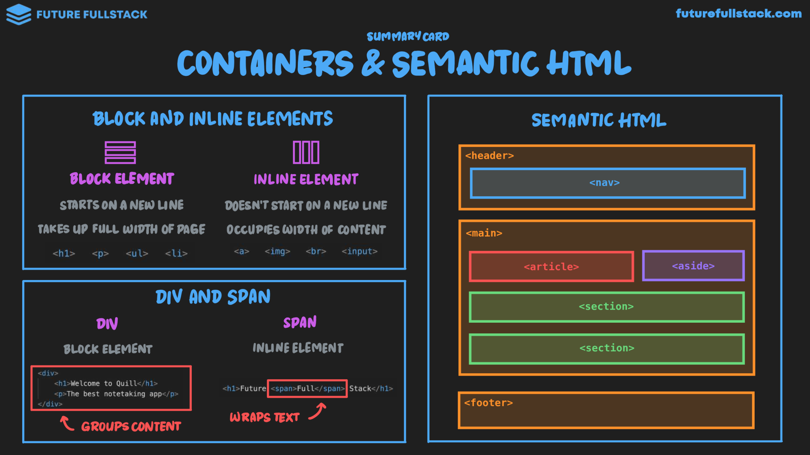

# Contenedores y HTML Semántico

=== "Block & Inline Elements"

    Los elementos HTML se dividen en dos categorías principales: **elementos de bloque** y **elementos en línea**.

    - **Elementos de bloque**: Ocupan todo el ancho disponible y comienzan en una nueva línea. Ejemplos: `
`, `
`, `<h1>`-`<h6>`, `<ul>`, `<ol>`, `<li>`.
    - **Elementos en línea**: Ocupan solo el espacio necesario y no comienzan en una nueva línea. Ejemplos: ``, `<a>`, `<strong>`, `<em>`.

=== "Div & Span"

    |Div|Span|
    |---|---|
    |`#!html 
`|`#!html `|
    |Agrupa bloques grandes de contenido HTML para aplicar estilos y posicionamiento|Envuelve texto para aplicarle estilos personalizados.|
    |Elemento a nivel de bloque|Elemento a nivel en línea|

=== "Semantic HTML"

    Es la utilización de etiquetas que describen el tipo de contenido que contienen,
    mejorando la accesibilidad y el SEO.

    |Etiqueta|Descripción|
    |---|---|
    |`#!html <header>`|Encabezado de la página o sección.|
    |`#!html <nav>`|Navegación principal del sitio.|
    |`#!html <main>`|Contenido principal de la página.|
    |`#!html <section>`|Agrupación temática de contenido.|
    |`#!html <article>`|Contenido independiente y autocontenido.|
    |`#!html <aside>`|Contenido relacionado, como barras laterales.|
    |`#!html <footer>`|Pie de página con información adicional.|
