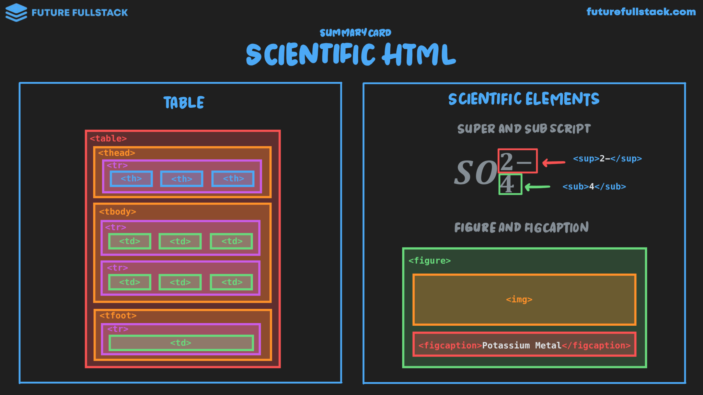

# Tablas y HTML Científico



=== "Tables"

    Estructuras de datos que organizan la información en filas y columnas.

    ??? tip "Ajuste de celdas"

        - **Colspan**: Especifica el número de **columnas** que debe abarcar una celda ^^horizontalmente^^.
          ```html
            <td colspan="4">Ventas totales</td>
          ```
        - **Rowspan**: Especifica el número de **filas** que debe abarcar una celda ^^verticalmente^^.
          ```html
              <td rowspan="3">Gran total</td>
          ```

    |Etiqueta|Descripción|
    |---|---|
    |`#!html <table>`|Contenedor principal de la tabla|
    |`#!html <thead>`|Define el encabezado de la tabla|
    |`#!html <tbody>`|Define el cuerpo de la tabla|
    |`#!html <tfoot>`|Define el pie de la tabla|
    |`#!html <tr>`|Define una fila de la tabla|
    |`#!html <th>`|Define una celda de encabezado|
    |`#!html <td>`|Define una celda de datos|

=== "Scientific Elements"

    |Etiqueta|Descripción|
    |---|---|
    |`#!html <sub>`|Texto en subíndice|
    |`#!html <sup>`|Texto en superíndice|
    |`#!html <figure>`|Indica que una imagen tiene una leyenda asociada|
    |`#!html <figcaption>`|Leyenda de la imagen|

    ??? example "Ejemplos"

        ```html title="Subscript & Superscript"
        <p>Formula química del agua: H<sub>2</sub>O</p>
        <p>Teoría de la Relatividad Especial: E = mc<sup>2</sup></p>
        ```

        ```html title="Figure & Figcaption"
        <figure>
            
            <figcaption>Potasio a temperatura ambiente</figcaption>
        </figure>
        ```
